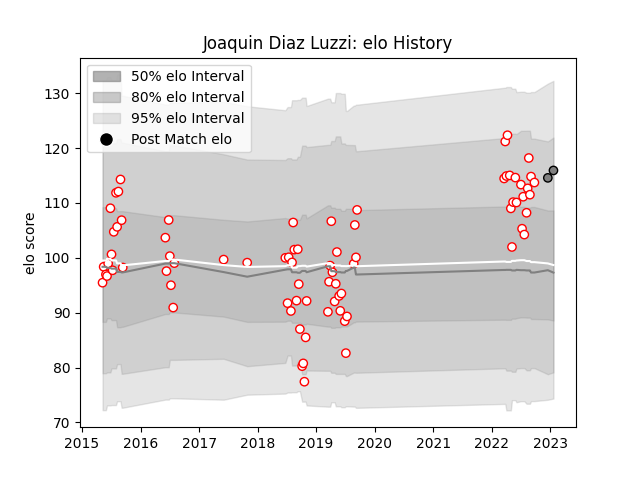

---  
layout: page  
title: Joaquin Diaz Luzzi  
date: 2023-03-17 17:00:11.851361  
categories: player  
---
# Joaquin Diaz Luzzi

## Positions: FH

## Current elo: 119.0

## Current Percentile: 90.0

# Elo History

# Match History

| Team   |   Appearances |   Win Rate |
|:-------|--------------:|-----------:|
| Alumni |            80 |        0.6 |
| Rennes |             5 |        0.4 |

| Opponent                   |   Matches |   Win Rate |
|:---------------------------|----------:|-----------:|
| CUBA                       |         8 |   0.75     |
| Hindu                      |         8 |   0.25     |
| Newman                     |         7 |   0.142857 |
| Belgrano                   |         7 |   0.571429 |
| Regatas Bella Vista        |         7 |   0.928571 |
| Pucara                     |         7 |   0.714286 |
| San Luis                   |         6 |   0.5      |
| CASI                       |         6 |   0.666667 |
| SIC                        |         6 |   0.333333 |
| Atlético del Rosario       |         5 |   0.7      |
| La Plata                   |         4 |   0.75     |
| Lomas                      |         3 |   1        |
| Los Tilos                  |         2 |   1        |
| Pueyrredón                 |         1 |   0        |
| Cognac Saint Jean d'Angély |         1 |   1        |
| Chambery                   |         1 |   1        |
| San Albano                 |         1 |   1        |
| Blagnac                    |         1 |   0        |
| San Martin                 |         1 |   1        |
| Suresnes                   |         1 |   0        |
| Universitario de La Plata  |         1 |   1        |
| Valence Romans Drome Rugby |         1 |   0        |