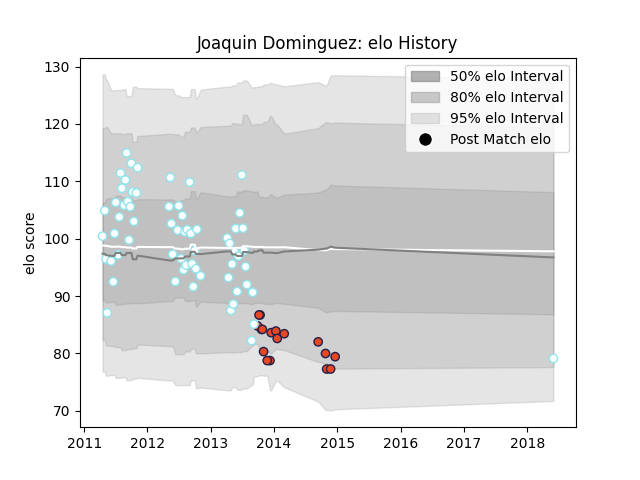

---  
layout: page  
title: Joaquin Dominguez  
date: 2023-02-24 02:26:35.856651  
categories: player  
---
# Joaquin Dominguez

## Positions: C

## Current elo: 79.0

## Current Percentile: None

# Elo History

# Match History

| Team      |   Appearances |   Win Rate |
|:----------|--------------:|-----------:|
| SIC       |            64 |   0.765625 |
| Edinburgh |            17 |   0.529412 |

| Opponent             |   Matches |   Win Rate |
|:---------------------|----------:|-----------:|
| Alumni               |         5 |   0.8      |
| La Plata             |         5 |   0.6      |
| San Luis             |         5 |   0.4      |
| CASI                 |         5 |   0.6      |
| Hindu                |         4 |   0.5      |
| Atlético del Rosario |         4 |   0.5      |
| Belgrano             |         4 |   0.75     |
| San Albano           |         3 |   1        |
| Regatas Bella Vista  |         3 |   1        |
| CUBA                 |         3 |   0.333333 |
| Olivos               |         3 |   1        |
| Lomas                |         3 |   1        |
| Pucara               |         3 |   1        |
| San Cirano           |         2 |   1        |
| Manuel Belgrano      |         2 |   1        |
| Perpignan            |         2 |   0.5      |
| Newman               |         2 |   1        |
| Munster              |         2 |   0.5      |
| Los Tilos            |         2 |   1        |
| Gloucester Rugby     |         2 |   0.5      |
| Champagnat           |         2 |   1        |
| Cardiff Blues        |         2 |   0.5      |
| Benetton Treviso     |         2 |   1        |
| Lyon                 |         1 |   1        |
| Los Matreros         |         1 |   1        |
| Liceo Militar        |         1 |   1        |
| Leinster             |         1 |   0        |
| Ospreys              |         1 |   1        |
| Deportiva Francesa   |         1 |   1        |
| Connacht             |         1 |   0        |
| San Martin           |         1 |   1        |
| Scarlets             |         1 |   0        |
| Ulster               |         1 |   0        |
| Zebre                |         1 |   1        |