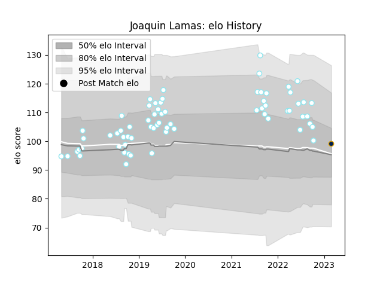

---  
layout: page  
title: Joaquin Lamas  
date: 2023-03-04 11:36:06.203301  
categories: player  
---
# Joaquin Lamas

## Positions: FH

## Current elo: 99.0

## Current Percentile: 63.0

# Elo History

# Match History

| Team      |   Appearances |   Win Rate |
|:----------|--------------:|-----------:|
| SIC       |            67 |   0.731343 |
| Pampas XV |             1 |   0        |

| Opponent             |   Matches |   Win Rate |
|:---------------------|----------:|-----------:|
| Alumni               |         8 |   0.875    |
| CASI                 |         8 |   0.625    |
| Belgrano             |         7 |   0.714286 |
| CUBA                 |         7 |   0.857143 |
| Newman               |         7 |   0.571429 |
| Regatas Bella Vista  |         6 |   0.833333 |
| San Luis             |         6 |   0.5      |
| Pucara               |         5 |   0.6      |
| Hindu                |         3 |   0.333333 |
| Atlético del Rosario |         2 |   1        |
| Buenos Aires         |         2 |   1        |
| La Plata             |         2 |   1        |
| Los Tilos            |         2 |   1        |
| Lomas                |         1 |   1        |
| San Martin           |         1 |   1        |
| Selknam              |         1 |   0        |