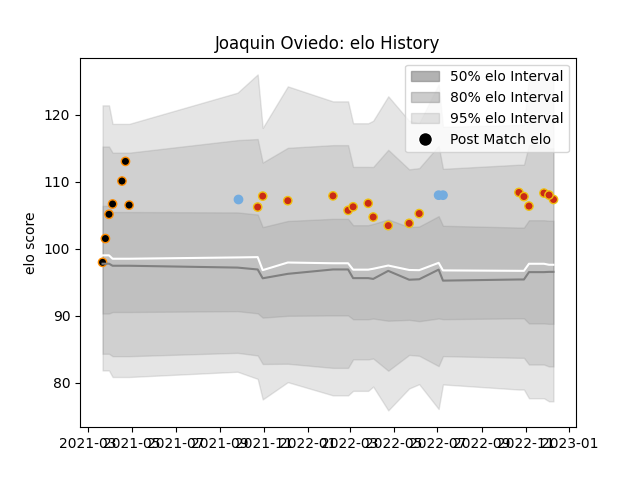

---  
layout: page  
title: Joaquin Oviedo  
date: 2023-01-06 00:12:50.061225  
categories: player  
---
# Joaquin Oviedo

## Positions: N8, FL

## Country: Argentina

## Current elo: 109.0

## Current Percentile: 70.0

# Elo History

# Match History

| Team        |   Appearances |   Win Rate |
|:------------|--------------:|-----------:|
| Perpignan   |            19 |   0.315789 |
| Jaguares XV |             8 |   1        |
| Argentina   |             3 |   0.666667 |

| Opponent            |   Matches |   Win Rate |
|:--------------------|----------:|-----------:|
| Bordeaux Begles     |         3 |   0.666667 |
| La Rochelle         |         3 |   0.333333 |
| Montpellier Herault |         3 |   0        |
| Stade Toulousain    |         2 |   0.5      |
| Olimpia Lions       |         2 |   1        |
| Selknam             |         2 |   1        |
| Cafeteros Pro       |         2 |   1        |
| Racing 92           |         2 |   0.5      |
| Penarol Rugby       |         2 |   1        |
| Portugal            |         1 |   1        |
| Pau                 |         1 |   0        |
| Australia           |         1 |   0        |
| Bayonne             |         1 |   0        |
| Georgia             |         1 |   1        |
| Clermont Auvergne   |         1 |   0        |
| Castres Olympique   |         1 |   0        |
| Bristol Rugby       |         1 |   0        |
| Lyon                |         1 |   1        |