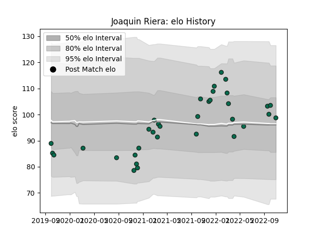

---  
layout: page  
title: Joaquin Riera  
date: 2022-12-14 11:36:54.789049  
categories: player  
---
# Joaquin Riera

## Positions: C

## Current elo: 89.0

## Current Percentile: 29.0

# Elo History

# Match History

| Team             |   Appearances |   Win Rate |
|:-----------------|--------------:|-----------:|
| Benetton Treviso |            35 |   0.271429 |

| Opponent             |   Matches |   Win Rate |
|:---------------------|----------:|-----------:|
| Connacht             |         5 |   0        |
| Glasgow Warriors     |         5 |   0.4      |
| Cardiff Blues        |         3 |   0.333333 |
| Dragons              |         3 |   0.5      |
| Leinster             |         3 |   0        |
| Munster              |         3 |   0        |
| Ospreys              |         3 |   0        |
| Edinburgh            |         2 |   0.5      |
| Scarlets             |         2 |   0.5      |
| Stade Francais Paris |         2 |   0.5      |
| Zebre                |         2 |   0.5      |
| Sharks               |         1 |   0        |
| Stormers             |         1 |   1        |