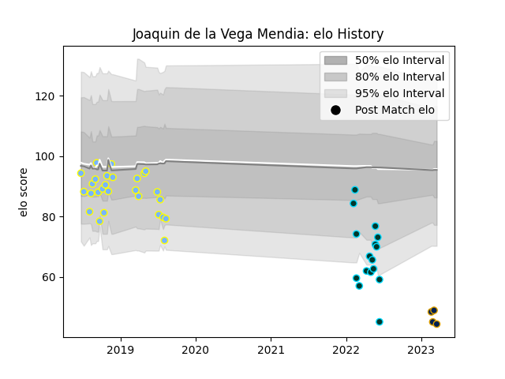

---  
layout: page  
title: Joaquin de la Vega Mendia  
date: 2023-03-04 11:38:31.250258  
categories: player  
---
# Joaquin de la Vega Mendia

## Positions: FB, C

## Current elo: 49.0

## Current Percentile: 1.0

# Elo History

# Match History

| Team      |   Appearances |   Win Rate |
|:----------|--------------:|-----------:|
| Hindu     |            27 |   0.574074 |
| Rugby ATL |            16 |   0.5625   |
| Pampas XV |             3 |   0.666667 |

| Opponent               |   Matches |   Win Rate |
|:-----------------------|----------:|-----------:|
| Alumni                 |         4 |   0.5      |
| Belgrano               |         4 |   0.5      |
| NOLA Gold              |         3 |   1        |
| Rugby New York         |         3 |   0.333333 |
| Regatas Bella Vista    |         3 |   0.833333 |
| R.U. New York          |         3 |   0.333333 |
| Pucara                 |         3 |   0.333333 |
| Newman                 |         3 |   0.333333 |
| CASI                   |         2 |   0.5      |
| Atlético del Rosario   |         2 |   1        |
| La Plata               |         1 |   1        |
| Toronto Arrows         |         1 |   1        |
| Selknam                |         1 |   0        |
| San Martin             |         1 |   1        |
| San Luis               |         1 |   0        |
| San Diego Legion       |         1 |   1        |
| SIC                    |         1 |   1        |
| L. A. Giltinis         |         1 |   0        |
| CUBA                   |         1 |   0        |
| Cobras                 |         1 |   1        |
| Old Glory DC           |         1 |   1        |
| American Raptors       |         1 |   1        |
| New England Free Jacks |         1 |   0        |
| Houston SaberCats      |         1 |   1        |
| Lomas                  |         1 |   1        |
| Utah Warriors          |         1 |   0        |