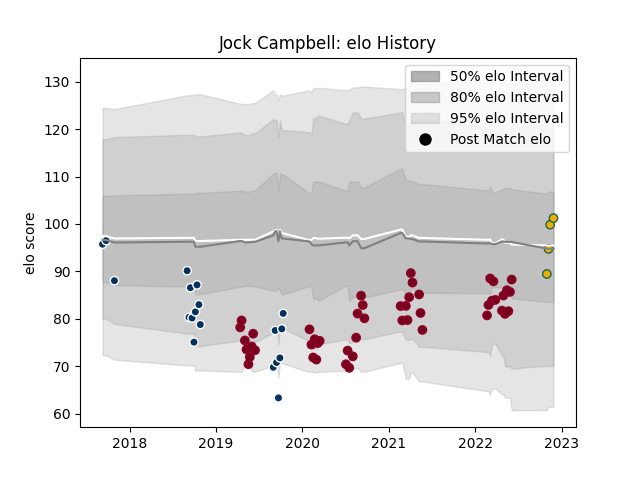

---  
layout: page  
title: Jock Campbell  
date: 2022-11-15 23:44:39.078542  
categories: player  
---
# Jock Campbell

## Positions: FB, W

## Country: Australia

## Current elo: 104.0

## Current Percentile: 66.0

# Elo History

# Match History

| Team            |   Appearances |   Win Rate |
|:----------------|--------------:|-----------:|
| Queensland Reds |            48 |   0.53125  |
| Australia       |             3 |   0.333333 |

| Opponent                 |   Matches |   Win Rate |
|:-------------------------|----------:|-----------:|
| Brumbies                 |         9 |   0.444444 |
| Melbourne Rebels         |         7 |   0.785714 |
| New South Wales Waratahs |         6 |   0.833333 |
| Western Force            |         4 |   1        |
| Crusaders                |         4 |   0        |
| Sunwolves                |         2 |   1        |
| Sharks                   |         2 |   0.5      |
| Jaguares                 |         2 |   0        |
| Blues                    |         2 |   0.5      |
| Highlanders              |         2 |   0        |
| Chiefs                   |         2 |   0        |
| Bulls                    |         2 |   0.5      |
| Hurricanes               |         1 |   0        |
| Lions                    |         1 |   0        |
| France                   |         1 |   0        |
| Moana Pasifika           |         1 |   1        |
| Fijian Drua              |         1 |   1        |
| Scotland                 |         1 |   1        |
| Italy                    |         1 |   0        |