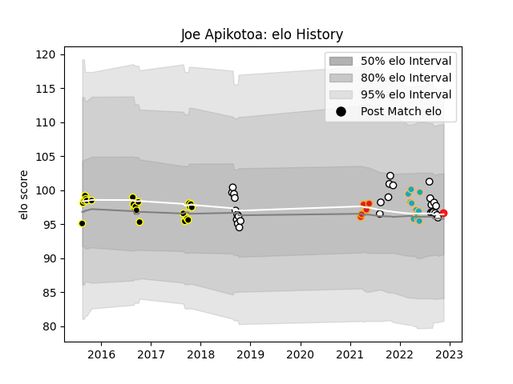

---  
layout: page  
title: Joe Apikotoa  
date: 2022-11-22 11:26:22.313419  
categories: player  
---
# Joe Apikotoa

## Positions: P

## Country: Tonga

## Current elo: 97.0

## Current Percentile: 50.0

# Elo History

# Match History

| Team           |   Appearances |   Win Rate |
|:---------------|--------------:|-----------:|
| Hawke's Bay    |            28 |   0.517857 |
| Wellington     |            22 |   0.772727 |
| Moana Pasifika |            11 |   0.181818 |
| Chiefs         |             5 |   0.8      |
| Tonga          |             1 |   1        |

| Opponent                 |   Matches |   Win Rate |
|:-------------------------|----------:|-----------:|
| Otago                    |         7 |   0.428571 |
| Tasman                   |         5 |   0.4      |
| Southland                |         5 |   1        |
| Bay of Plenty            |         4 |   0.75     |
| North Harbour            |         4 |   0.75     |
| Waikato                  |         4 |   0.625    |
| Taranaki                 |         4 |   0.5      |
| Northland                |         4 |   1        |
| Canterbury               |         3 |   0.333333 |
| Counties Manukau         |         3 |   0.666667 |
| Hawke's Bay              |         3 |   0.666667 |
| Hurricanes               |         3 |   0.666667 |
| Blues                    |         3 |   0.333333 |
| Wellington               |         2 |   0        |
| Western Force            |         2 |   0.5      |
| Manawatu                 |         2 |   1        |
| New South Wales Waratahs |         1 |   0        |
| Queensland Reds          |         1 |   0        |
| Highlanders              |         1 |   1        |
| Fijian Drua              |         1 |   0        |
| Crusaders                |         1 |   0        |
| Uruguay                  |         1 |   1        |
| Chiefs                   |         1 |   0        |
| Brumbies                 |         1 |   1        |
| Melbourne Rebels         |         1 |   0        |