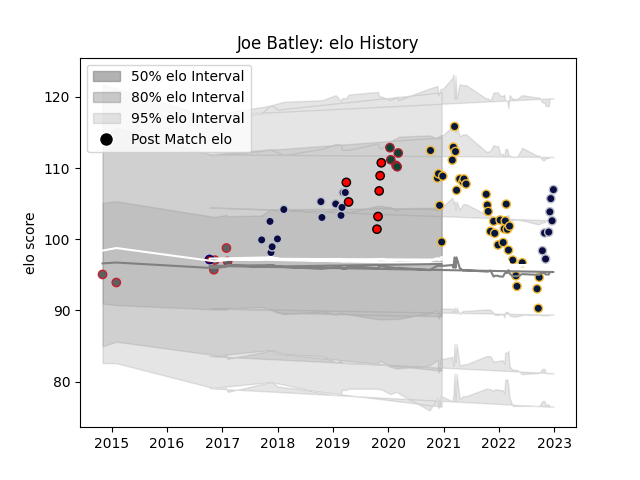

---  
layout: page  
title: Joe Batley  
date: 2022-12-31 16:28:43.612543  
categories: player  
---
# Joe Batley

## Positions: L, FL

## Current elo: 100.0

## Current Percentile: 83.0

# Elo History

# Match History

| Team               |   Appearances |   Win Rate |
|:-------------------|--------------:|-----------:|
| Worcester Warriors |            38 |   0.197368 |
| Bristol Rugby      |            21 |   0.642857 |
| Hartpury College   |             7 |   0.571429 |
| Gloucester Rugby   |             6 |   0.583333 |
| Leicester Tigers   |             5 |   0.4      |
| Rotherham Titans   |             1 |   0        |

| Opponent            |   Matches |   Win Rate |
|:--------------------|----------:|-----------:|
| Northampton Saints  |         7 |   0.142857 |
| Saracens            |         6 |   0.333333 |
| London Irish        |         5 |   0.2      |
| Bath Rugby          |         5 |   0.3      |
| Exeter Chiefs       |         5 |   0.2      |
| Bristol Rugby       |         4 |   0.25     |
| Newcastle Falcons   |         4 |   0.375    |
| Harlequins          |         4 |   0.25     |
| Leicester Tigers    |         4 |   0.125    |
| Wasps               |         3 |   0.333333 |
| Sale Sharks         |         3 |   0        |
| Zebre               |         3 |   0.666667 |
| Gloucester Rugby    |         3 |   0.333333 |
| Nottingham          |         2 |   1        |
| Ospreys             |         2 |   0.5      |
| Pau                 |         2 |   0        |
| Richmond            |         2 |   1        |
| Bedford             |         2 |   0.5      |
| Worcester Warriors  |         2 |   0.5      |
| Yorkshire Carnegie  |         2 |   1        |
| London Scottish     |         1 |   1        |
| Ealing Trailfinders |         1 |   1        |
| Perpignan           |         1 |   1        |
| RC Enisei           |         1 |   1        |
| Rotherham Titans    |         1 |   1        |
| Dragons             |         1 |   1        |
| Cardiff Blues       |         1 |   1        |
| Ampthill            |         1 |   0        |