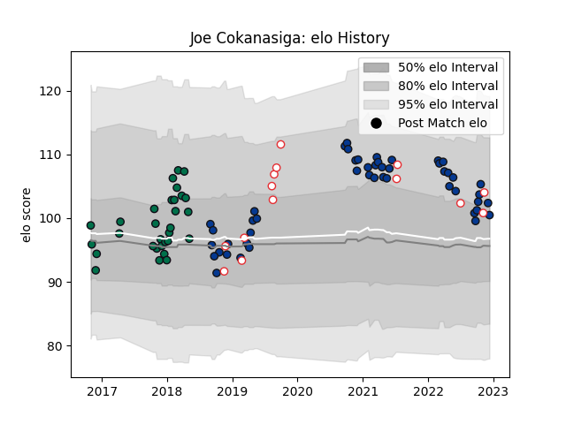

---  
layout: page  
title: Joe Cokanasiga  
date: 2023-02-02 18:51:58.589796  
categories: player  
---
# Joe Cokanasiga

## Positions: W

## Country: England

## Current elo: 116.0

## Current Percentile: 86.0

# Elo History

# Match History

| Team         |   Appearances |   Win Rate |
|:-------------|--------------:|-----------:|
| Bath Rugby   |            54 |   0.37037  |
| London Irish |            30 |   0.433333 |
| England      |            14 |   0.714286 |

| Opponent                 |   Matches |   Win Rate |
|:-------------------------|----------:|-----------:|
| Exeter Chiefs            |         8 |   0        |
| Sale Sharks              |         7 |   0.142857 |
| Gloucester Rugby         |         7 |   0.214286 |
| Wasps                    |         7 |   0.357143 |
| Newcastle Falcons        |         6 |   0.666667 |
| Harlequins               |         5 |   0.4      |
| Northampton Saints       |         5 |   0.6      |
| Worcester Warriors       |         5 |   0.6      |
| Saracens                 |         4 |   0.125    |
| Bristol Rugby            |         4 |   0.5      |
| Wales                    |         3 |   0.333333 |
| Leicester Tigers         |         3 |   0.666667 |
| London Irish             |         3 |   0.333333 |
| Bath Rugby               |         3 |   0        |
| United States of America |         2 |   1        |
| Glasgow Warriors         |         2 |   0.25     |
| Rotherham Titans         |         2 |   1        |
| Toulon                   |         2 |   0        |
| Italy                    |         2 |   1        |
| Japan                    |         2 |   1        |
| Stade Francais Paris     |         2 |   0.5      |
| Australia                |         2 |   0.5      |
| Krasny Yar               |         2 |   1        |
| Argentina                |         1 |   0        |
| London Scottish          |         1 |   1        |
| Leinster                 |         1 |   0        |
| Jersey                   |         1 |   1        |
| Ireland                  |         1 |   1        |
| Edinburgh                |         1 |   0        |
| Doncaster                |         1 |   1        |
| Cardiff Blues            |         1 |   1        |
| Canada                   |         1 |   1        |
| Yorkshire Carnegie       |         1 |   1        |