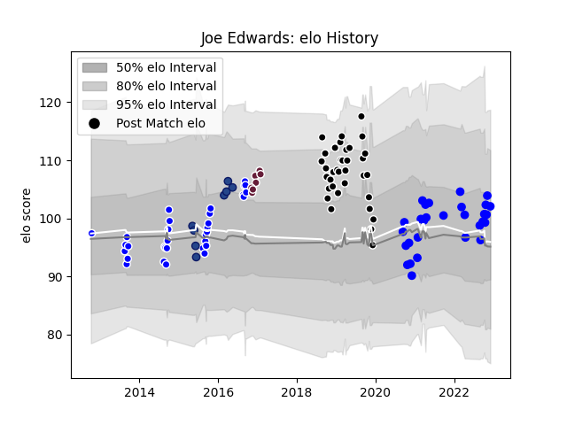

---  
layout: page  
title: Joe Edwards  
date: 2023-01-13 11:32:01.682894  
categories: player  
---
# Joe Edwards

## Positions: FL, N8

## Current elo: 106.0

## Current Percentile: 80.0

# Elo History

# Match History

| Team            |   Appearances |   Win Rate |
|:----------------|--------------:|-----------:|
| Vannes          |            45 |   0.588889 |
| Provence Rugby  |            37 |   0.513514 |
| Auckland        |            32 |   0.65625  |
| Blues           |             8 |   0.3125   |
| Bordeaux Begles |             7 |   0.785714 |

| Opponent                   |   Matches |   Win Rate |
|:---------------------------|----------:|-----------:|
| Mont-de-Marsan             |         7 |   0.714286 |
| Colomiers                  |         6 |   0.666667 |
| Beziers                    |         6 |   0.5      |
| Oyonnax                    |         6 |   0.333333 |
| Nevers                     |         5 |   0.7      |
| Aurillac                   |         5 |   0.6      |
| Biarritz Olympique         |         5 |   0.6      |
| Grenoble                   |         5 |   0.6      |
| Carcassonne                |         4 |   0.5      |
| Massy                      |         4 |   0.5      |
| Provence Rugby             |         4 |   0.5      |
| Soyaux-Angouleme           |         4 |   0.25     |
| Montauban                  |         4 |   0.75     |
| Canterbury                 |         4 |   0        |
| Waikato                    |         4 |   0.5      |
| Tasman                     |         3 |   0.833333 |
| Rouen                      |         3 |   0.666667 |
| Counties Manukau           |         3 |   0.333333 |
| North Harbour              |         3 |   1        |
| Northland                  |         3 |   1        |
| Bayonne                    |         3 |   0.333333 |
| Manawatu                   |         3 |   1        |
| Highlanders                |         2 |   0.5      |
| Taranaki                   |         2 |   0.5      |
| US Bressane                |         2 |   1        |
| Southland                  |         2 |   0.75     |
| Hawke's Bay                |         2 |   0.5      |
| Exeter Chiefs              |         2 |   0.5      |
| Valence Romans Drome Rugby |         2 |   0.5      |
| Vannes                     |         2 |   0.5      |
| Brive                      |         2 |   0.5      |
| Perpignan                  |         2 |   0.5      |
| Agen                       |         1 |   0        |
| Stade Francais Paris       |         1 |   1        |
| Ulster                     |         1 |   1        |
| Melbourne Rebels           |         1 |   0        |
| Roval Drome XV             |         1 |   1        |
| Queensland Reds            |         1 |   0.5      |
| Otago                      |         1 |   1        |
| Lions                      |         1 |   0        |
| La Rochelle                |         1 |   1        |
| Jaguares                   |         1 |   1        |
| Hurricanes                 |         1 |   0        |
| Crusaders                  |         1 |   0        |
| Clermont Auvergne          |         1 |   0.5      |
| Bay of Plenty              |         1 |   1        |
| Wellington                 |         1 |   1        |