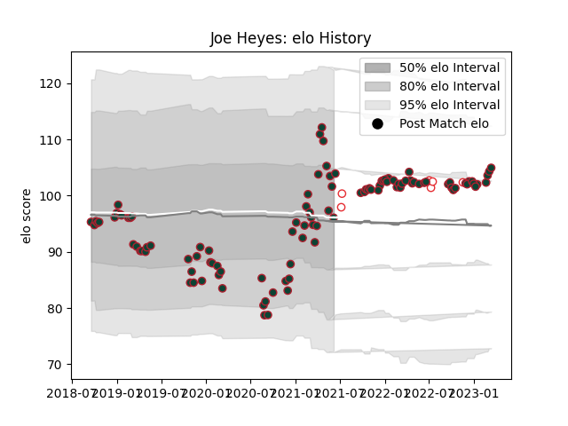

---  
layout: page  
title: Joe Heyes  
date: 2022-12-09 13:21:51.502968  
categories: player  
---
# Joe Heyes

## Positions: P

## Country: England

## Current elo: 102.0

## Current Percentile: 73.0

# Elo History

# Match History

| Team             |   Appearances |   Win Rate |
|:-----------------|--------------:|-----------:|
| Leicester Tigers |            91 |   0.565934 |
| England          |             7 |   0.714286 |

| Opponent                 |   Matches |   Win Rate |
|:-------------------------|----------:|-----------:|
| Bath Rugby               |         8 |   0.375    |
| Worcester Warriors       |         7 |   0.714286 |
| Gloucester Rugby         |         7 |   0.857143 |
| Wasps                    |         7 |   0.571429 |
| Sale Sharks              |         7 |   0.285714 |
| London Irish             |         7 |   0.714286 |
| Saracens                 |         6 |   0.166667 |
| Northampton Saints       |         6 |   0.666667 |
| Harlequins               |         6 |   0.5      |
| Bristol Rugby            |         6 |   0.416667 |
| Exeter Chiefs            |         5 |   0.2      |
| Newcastle Falcons        |         5 |   1        |
| Australia                |         3 |   0.666667 |
| Cardiff Blues            |         2 |   1        |
| Scarlets                 |         2 |   0.5      |
| Calvisano                |         2 |   1        |
| Connacht                 |         2 |   1        |
| Ulster                   |         2 |   0        |
| Bayonne                  |         1 |   1        |
| United States of America |         1 |   1        |
| Brive                    |         1 |   1        |
| Bordeaux Begles          |         1 |   1        |
| Pau                      |         1 |   0        |
| Japan                    |         1 |   1        |
| Canada                   |         1 |   1        |
| Argentina                |         1 |   0        |