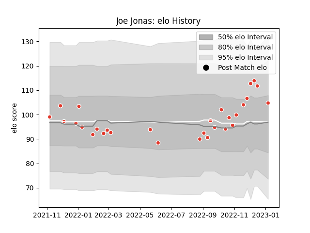

---  
layout: page  
title: Joe Jonas  
date: 2023-02-02 19:04:27.233857  
categories: player  
---
# Joe Jonas

## Positions: FB

## Current elo: 106.0

## Current Percentile: 76.0

# Elo History

# Match History

| Team               |   Appearances |   Win Rate |
|:-------------------|--------------:|-----------:|
| Biarritz Olympique |            31 |   0.387097 |

| Opponent             |   Matches |   Win Rate |
|:---------------------|----------:|-----------:|
| Agen                 |         2 |        0   |
| Clermont Auvergne    |         2 |        0   |
| Stade Francais Paris |         2 |        0.5 |
| Colomiers            |         2 |        0.5 |
| Montauban            |         2 |        1   |
| Carcassonne          |         1 |        1   |
| Oyonnax              |         1 |        1   |
| Toulon               |         1 |        0   |
| Stade Toulousain     |         1 |        0   |
| Beziers              |         1 |        0   |
| Soyaux-Angouleme     |         1 |        1   |
| Rouen                |         1 |        0   |
| Provence Rugby       |         1 |        1   |
| Perpignan            |         1 |        0   |
| Pau                  |         1 |        0   |
| Nevers               |         1 |        0.5 |
| Brive                |         1 |        0   |
| Montpellier Herault  |         1 |        0   |
| Aurillac             |         1 |        1   |
| Mont-de-Marsan       |         1 |        0   |
| Massy                |         1 |        1   |
| Lyon                 |         1 |        0   |
| La Rochelle          |         1 |        1   |
| Grenoble             |         1 |        0.5 |
| Bordeaux Begles      |         1 |        0   |
| Vannes               |         1 |        0   |