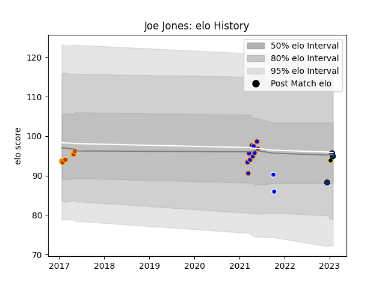

---  
layout: page  
title: Joe Jones  
date: 2022-12-18 16:26:31.200801  
categories: player  
---
# Joe Jones

## Positions: P

## Current elo: 92.0

## Current Percentile: None

# Elo History

# Match History

| Team        |   Appearances |   Win Rate |
|:------------|--------------:|-----------:|
| Sale Sharks |            40 |      0.625 |

| Opponent           |   Matches |   Win Rate |
|:-------------------|----------:|-----------:|
| Northampton Saints |         4 |   0.75     |
| Bath Rugby         |         3 |   0.666667 |
| Bristol Rugby      |         3 |   0.833333 |
| Exeter Chiefs      |         3 |   0        |
| Gloucester Rugby   |         3 |   1        |
| Harlequins         |         3 |   0.666667 |
| Leicester Tigers   |         3 |   0.666667 |
| Newcastle Falcons  |         3 |   0.666667 |
| Saracens           |         3 |   0.333333 |
| Worcester Warriors |         3 |   0.666667 |
| Connacht           |         2 |   0.5      |
| Perpignan          |         2 |   1        |
| Wasps              |         2 |   0.5      |
| Bordeaux Begles    |         1 |   1        |
| La Rochelle        |         1 |   0        |
| London Irish       |         1 |   0.5      |