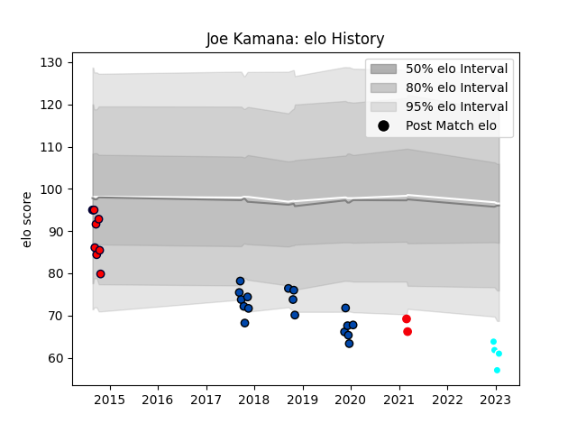

---  
layout: page  
title: Joe Kamana  
date: 2023-03-21 18:46:37.955391  
categories: player  
---
# Joe Kamana

Last updated: 2023-03-21
## Positions: C, W

## Current elo: 53.0

## Current Percentile: 2.0

# Elo History

# Match History

| Team                 |   Appearances |   Win Rate |
|:---------------------|--------------:|-----------:|
| Mazda Blue Zoomers   |            17 |   0.382353 |
| Melbourne Rising     |             9 |   0.888889 |
| Coca-Cola Red Sparks |             5 |   0.4      |

| Opponent                         |   Matches |   Win Rate |
|:---------------------------------|----------:|-----------:|
| Kyuden Voltex                    |         3 |   0.666667 |
| Kamaishi Seawaves                |         3 |   0.5      |
| Chugoku Red Regulions            |         3 |   0.666667 |
| Shimizu Blue Sharks              |         2 |   1        |
| Perth Spirit                     |         2 |   0.5      |
| Mitsubishi Dynaboars             |         2 |   0        |
| Toyota Industries Shuttles Aichi |         2 |   0        |
| Hanazono Kintetsu Liners         |         2 |   0        |
| Hino Red Dolphins                |         1 |   0        |
| Kurita Water Gush                |         1 |   0        |
| Canberra Vikings                 |         1 |   1        |
| Mie Honda Heat                   |         1 |   0        |
| Greater Sydney Rams              |         1 |   1        |
| NSW Country Eagles               |         1 |   1        |
| North Harbour Rays               |         1 |   1        |
| Coca-Cola Red Sparks             |         1 |   0        |
| Queensland Country               |         1 |   1        |
| Chubu Electric Power             |         1 |   1        |
| Sydney Stars                     |         1 |   1        |
| Brisbane City                    |         1 |   1        |