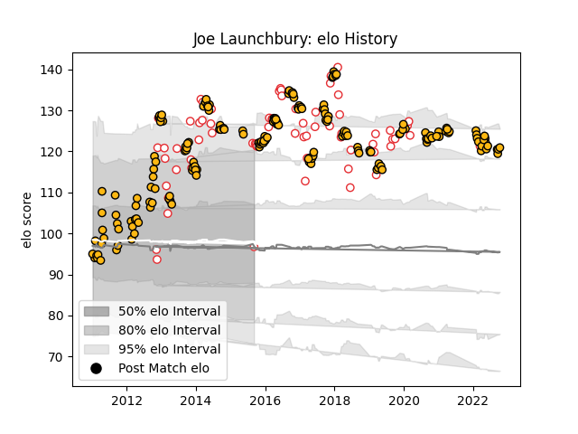

---  
layout: page  
title: Joe Launchbury  
date: 2022-12-28 12:58:40.449060  
categories: player  
---
# Joe Launchbury

## Positions: L

## Country: England

## Current elo: 96.0

## Current Percentile: 87.0

# Elo History

# Match History

| Team            |   Appearances |   Win Rate |
|:----------------|--------------:|-----------:|
| Wasps           |           173 |   0.526012 |
| England         |            68 |   0.698529 |
| Toyota Verblitz |             1 |   0        |

| Opponent                 |   Matches |   Win Rate |
|:-------------------------|----------:|-----------:|
| Bath Rugby               |        20 |   0.55     |
| Exeter Chiefs            |        18 |   0.333333 |
| Harlequins               |        14 |   0.142857 |
| Northampton Saints       |        13 |   0.538462 |
| Saracens                 |        12 |   0.25     |
| Wales                    |        11 |   0.636364 |
| Leicester Tigers         |        11 |   0.454545 |
| Sale Sharks              |        11 |   0.272727 |
| Worcester Warriors       |        10 |   1        |
| Newcastle Falcons        |         9 |   0.777778 |
| Gloucester Rugby         |         8 |   0.75     |
| Scotland                 |         7 |   0.785714 |
| London Irish             |         7 |   0.714286 |
| Italy                    |         7 |   1        |
| Ireland                  |         7 |   0.571429 |
| France                   |         7 |   0.571429 |
| Australia                |         7 |   0.714286 |
| Bristol Rugby            |         6 |   0.666667 |
| Argentina                |         6 |   1        |
| Leinster                 |         6 |   0.333333 |
| New Zealand              |         5 |   0.2      |
| South Africa             |         4 |   0.5      |
| Bayonne                  |         4 |   0.875    |
| Fiji                     |         3 |   1        |
| Stade Toulousain         |         2 |   0.75     |
| Ulster                   |         2 |   0.5      |
| Zebre                    |         2 |   1        |
| Connacht                 |         2 |   0.5      |
| Bordeaux Begles          |         2 |   0        |
| London Welsh             |         2 |   1        |
| La Rochelle              |         2 |   0.5      |
| Dragons                  |         2 |   1        |
| Yorkshire Carnegie       |         1 |   1        |
| Barbarians               |         1 |   0        |
| Biarritz Olympique       |         1 |   0        |
| Uruguay                  |         1 |   1        |
| United States of America |         1 |   1        |
| Mogliano                 |         1 |   1        |
| Toulon                   |         1 |   1        |
| Mitsubishi Dynaboars     |         1 |   0        |
| Grenoble                 |         1 |   1        |
| Samoa                    |         1 |   1        |
| Leeds                    |         1 |   1        |
| Ospreys                  |         1 |   0        |
| Agen                     |         1 |   1        |