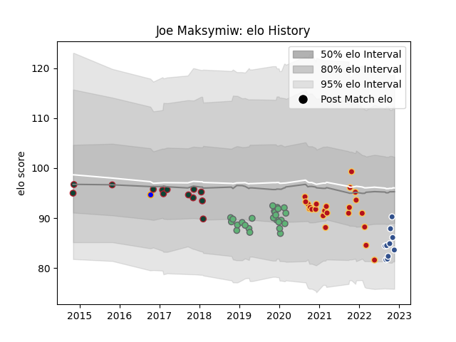

---  
layout: page  
title: Joe Maksymiw  
date: 2023-03-21 18:12:27.946578  
categories: player  
---
# Joe Maksymiw

Last updated: 2023-03-21
## Positions: L

## Current elo: 62.0

## Current Percentile: 6.0

# Elo History

# Match History

| Team             |   Appearances |   Win Rate |
|:-----------------|--------------:|-----------:|
| Connacht         |            25 |   0.44     |
| Dragons          |            25 |   0.24     |
| Agen             |            13 |   0.461538 |
| Leicester Tigers |            13 |   0.692308 |
| Doncaster        |             4 |   0.75     |

| Opponent            |   Matches |   Win Rate |
|:--------------------|----------:|-----------:|
| Leinster            |         5 |   0        |
| Cardiff Blues       |         4 |   0.5      |
| Ospreys             |         4 |   0.625    |
| Gloucester Rugby    |         4 |   0.75     |
| Ulster              |         4 |   0        |
| Zebre               |         3 |   0.666667 |
| Sale Sharks         |         3 |   0.333333 |
| Glasgow Warriors    |         3 |   0.333333 |
| Munster             |         3 |   0        |
| Saracens            |         2 |   0.5      |
| Bath Rugby          |         2 |   0.5      |
| Connacht            |         2 |   0.5      |
| Montpellier Herault |         2 |   0.5      |
| Nottingham          |         2 |   1        |
| Edinburgh           |         2 |   0        |
| Stade Toulousain    |         2 |   0        |
| Bordeaux Begles     |         2 |   0.5      |
| Benetton Treviso    |         2 |   0.75     |
| Southern Kings      |         2 |   1        |
| Wasps               |         2 |   0        |
| Perpignan           |         2 |   1        |
| Oyonnax             |         1 |   0        |
| Soyaux-Angouleme    |         1 |   0        |
| Provence Rugby      |         1 |   1        |
| Vannes              |         1 |   1        |
| Scarlets            |         1 |   0        |
| Rouen               |         1 |   1        |
| Aurillac            |         1 |   1        |
| Northampton Saints  |         1 |   1        |
| Montauban           |         1 |   0        |
| Massy               |         1 |   1        |
| London Irish        |         1 |   1        |
| Lions               |         1 |   0        |
| Harlequins          |         1 |   1        |
| Grenoble            |         1 |   0        |
| Dragons             |         1 |   1        |
| Cornish Pirates     |         1 |   0        |
| Colomiers           |         1 |   0        |
| Castres Olympique   |         1 |   0        |
| Carcassonne         |         1 |   0        |
| Bristol Rugby       |         1 |   0        |
| Biarritz Olympique  |         1 |   1        |
| Beziers             |         1 |   0        |
| London Scottish     |         1 |   1        |