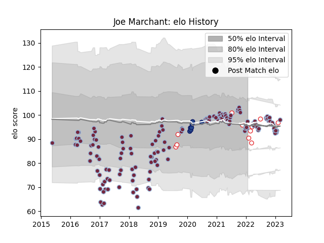

---  
layout: page  
title: Joe Marchant  
date: 2023-03-21 18:17:20.360881  
categories: player  
---
# Joe Marchant

Last updated: 2023-03-21
## Positions: C, W

## Country: England

## Current elo: 97.0

## Current Percentile: 47.0

# Elo History

# Match History

| Team       |   Appearances |   Win Rate |
|:-----------|--------------:|-----------:|
| Harlequins |           145 |   0.52069  |
| England    |            14 |   0.5      |
| Blues      |             7 |   0.714286 |

| Opponent                 |   Matches |   Win Rate |
|:-------------------------|----------:|-----------:|
| Northampton Saints       |        14 |   0.428571 |
| Exeter Chiefs            |        13 |   0.384615 |
| Sale Sharks              |        12 |   0.5      |
| Newcastle Falcons        |        11 |   0.636364 |
| Leicester Tigers         |        11 |   0.363636 |
| Bath Rugby               |        10 |   0.7      |
| Gloucester Rugby         |        10 |   0.8      |
| Wasps                    |         9 |   0.555556 |
| Bristol Rugby            |         9 |   0.666667 |
| Worcester Warriors       |         8 |   0.5      |
| Saracens                 |         8 |   0        |
| London Irish             |         7 |   0.642857 |
| Ireland                  |         4 |   0.25     |
| Racing 92                |         3 |   0.333333 |
| Scotland                 |         2 |   0        |
| Sharks                   |         2 |   0.5      |
| Timisoara Saracens       |         2 |   1        |
| Wales                    |         2 |   1        |
| Montpellier Herault      |         2 |   0.5      |
| Agen                     |         2 |   1        |
| La Rochelle              |         2 |   0        |
| Benetton Treviso         |         2 |   0.5      |
| Edinburgh                |         2 |   0        |
| Cardiff Blues            |         2 |   1        |
| Italy                    |         2 |   1        |
| Castres Olympique        |         1 |   1        |
| Bulls                    |         1 |   1        |
| Canada                   |         1 |   1        |
| Stormers                 |         1 |   1        |
| Stade Francais Paris     |         1 |   1        |
| South Africa             |         1 |   1        |
| Australia                |         1 |   0        |
| Chiefs                   |         1 |   0        |
| Crusaders                |         1 |   0        |
| France                   |         1 |   0        |
| Grenoble                 |         1 |   0        |
| New South Wales Waratahs |         1 |   1        |
| Highlanders              |         1 |   1        |
| Hurricanes               |         1 |   1        |
| Scarlets                 |         1 |   1        |