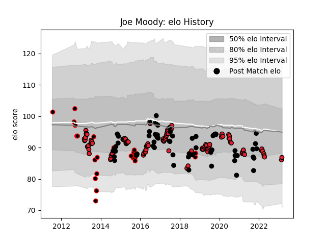

---  
layout: page  
title: Joe Moody  
date: 2023-03-17 17:39:35.694614  
categories: player  
---
# Joe Moody

## Positions: P

## Country: New Zealand

## Current elo: 87.0

## Current Percentile: 20.0

# Elo History

# Match History

| Team              |   Appearances |   Win Rate |
|:------------------|--------------:|-----------:|
| Crusaders         |           109 |   0.756881 |
| New Zealand       |            60 |   0.816667 |
| Canterbury        |            24 |   0.791667 |
| New Zealand Maori |             1 |   1        |

| Opponent                 |   Matches |   Win Rate |
|:-------------------------|----------:|-----------:|
| Highlanders              |        20 |   0.85     |
| Chiefs                   |        17 |   0.411765 |
| Australia                |        16 |   0.875    |
| Hurricanes               |        14 |   0.714286 |
| Blues                    |        13 |   0.846154 |
| Argentina                |         9 |   0.888889 |
| South Africa             |         9 |   0.722222 |
| Wales                    |         6 |   1        |
| Queensland Reds          |         6 |   1        |
| New South Wales Waratahs |         6 |   0.666667 |
| France                   |         6 |   0.833333 |
| Sharks                   |         5 |   0.7      |
| Auckland                 |         5 |   0.8      |
| Lions                    |         5 |   1        |
| Tasman                   |         4 |   0.75     |
| Ireland                  |         4 |   0.5      |
| Melbourne Rebels         |         4 |   0.75     |
| British and Irish Lions  |         4 |   0.375    |
| Bulls                    |         4 |   0.75     |
| Brumbies                 |         4 |   1        |
| Wellington               |         3 |   0.666667 |
| Western Force            |         2 |   0.5      |
| Stormers                 |         2 |   1        |
| Jaguares                 |         2 |   1        |
| Counties Manukau         |         2 |   1        |
| North Harbour            |         2 |   1        |
| Cheetahs                 |         2 |   1        |
| Taranaki                 |         2 |   0        |
| Bay of Plenty            |         1 |   1        |
| Waikato                  |         1 |   1        |
| United States of America |         1 |   1        |
| Tonga                    |         1 |   1        |
| Sunwolves                |         1 |   1        |
| Hawke's Bay              |         1 |   1        |
| Southern Kings           |         1 |   1        |
| Italy                    |         1 |   1        |
| Samoa                    |         1 |   1        |
| Otago                    |         1 |   1        |
| Northland                |         1 |   1        |
| Namibia                  |         1 |   1        |
| England                  |         1 |   0        |
| Manawatu                 |         1 |   1        |
| Fiji                     |         1 |   1        |
| Scotland                 |         1 |   1        |