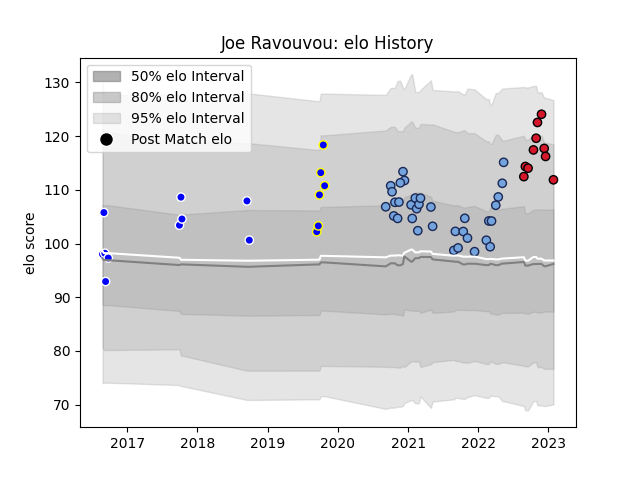

---  
layout: page  
title: Joe Ravouvou  
date: 2022-12-14 11:17:56.616696  
categories: player  
---
# Joe Ravouvou

## Positions: W

## Current elo: 109.0

## Current Percentile: 91.0

# Elo History

# Match History

| Team          |   Appearances |   Win Rate |
|:--------------|--------------:|-----------:|
| Bayonne       |            34 |   0.470588 |
| Auckland      |            10 |   0.6      |
| Oyonnax       |             8 |   0.75     |
| Bay of Plenty |             6 |   1        |

| Opponent             |   Matches |   Win Rate |
|:---------------------|----------:|-----------:|
| Hawke's Bay          |         3 |        1   |
| Montauban            |         3 |        1   |
| Mont-de-Marsan       |         3 |        0   |
| Agen                 |         2 |        1   |
| Northland            |         2 |        1   |
| Aurillac             |         2 |        1   |
| Toulon               |         2 |        1   |
| Manawatu             |         2 |        1   |
| Rouen                |         2 |        1   |
| La Rochelle          |         2 |        0   |
| Lyon                 |         2 |        0   |
| Colomiers            |         2 |        0.5 |
| Castres Olympique    |         2 |        0   |
| Carcassonne          |         2 |        0.5 |
| Canterbury           |         2 |        0.5 |
| Brive                |         2 |        0.5 |
| Bordeaux Begles      |         2 |        0   |
| Bay of Plenty        |         2 |        1   |
| Provence Rugby       |         2 |        0.5 |
| Vannes               |         1 |        1   |
| Waikato              |         1 |        0   |
| Tasman               |         1 |        0   |
| Taranaki             |         1 |        1   |
| Stade Toulousain     |         1 |        0   |
| Stade Francais Paris |         1 |        1   |
| Southland            |         1 |        1   |
| Montpellier Herault  |         1 |        1   |
| Pau                  |         1 |        0   |
| Oyonnax              |         1 |        1   |
| Otago                |         1 |        0   |
| Nevers               |         1 |        0.5 |
| Narbonne             |         1 |        1   |
| Massy                |         1 |        1   |
| Clermont Auvergne    |         1 |        0   |
| Biarritz Olympique   |         1 |        0   |
| Zebre                |         1 |        0.5 |