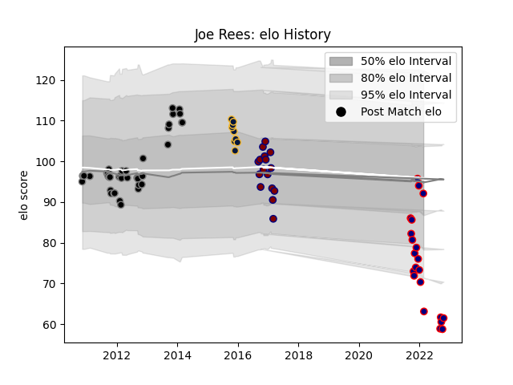

---  
layout: page  
title: Joe Rees  
date: 2023-03-21 18:56:28.894384  
categories: player  
---
# Joe Rees

Last updated: 2023-03-21
## Positions: P

## Current elo: 92.0

## Current Percentile: 4.0

# Elo History

# Match History

| Team               |   Appearances |   Win Rate |
|:-------------------|--------------:|-----------:|
| Ospreys            |            39 |   0.628205 |
| London Scottish    |            21 |   0.047619 |
| Rotherham Titans   |            16 |   0.34375  |
| Worcester Warriors |             9 |   0.333333 |

| Opponent            |   Matches |   Win Rate |
|:--------------------|----------:|-----------:|
| Jersey              |         5 |   0.2      |
| Munster             |         4 |   0.5      |
| Leinster            |         4 |   0.875    |
| Nottingham          |         4 |   0.125    |
| Richmond            |         4 |   0.5      |
| Connacht            |         4 |   1        |
| Edinburgh           |         4 |   0.75     |
| Ealing Trailfinders |         4 |   0        |
| Leicester Tigers    |         3 |   0.333333 |
| Doncaster           |         3 |   0        |
| Coventry            |         3 |   0.333333 |
| Cornish Pirates     |         3 |   0.333333 |
| Benetton Treviso    |         3 |   0.666667 |
| Bedford             |         3 |   0        |
| Ulster              |         3 |   0.333333 |
| Sale Sharks         |         2 |   0.5      |
| Northampton Saints  |         2 |   0.5      |
| Yorkshire Carnegie  |         2 |   0        |
| Newcastle Falcons   |         2 |   0.5      |
| Aironi              |         2 |   1        |
| Ampthill            |         2 |   0        |
| Gloucester Rugby    |         2 |   0.5      |
| Glasgow Warriors    |         2 |   0        |
| Exeter Chiefs       |         2 |   0        |
| Dragons             |         2 |   1        |
| London Irish        |         1 |   0        |
| London Scottish     |         1 |   0        |
| London Welsh        |         1 |   1        |
| La Rochelle         |         1 |   1        |
| Hartpury College    |         1 |   0        |
| Saracens            |         1 |   0        |
| Scarlets            |         1 |   1        |
| Wasps               |         1 |   1        |
| Worcester Warriors  |         1 |   0        |
| Bath Rugby          |         1 |   0        |
| Zebre               |         1 |   0        |