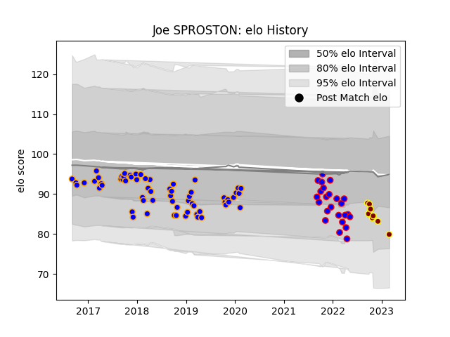

---  
layout: page  
title: Joe SPROSTON  
date: 2023-03-04 11:35:22.923591  
categories: player  
---
# Joe SPROSTON

## Positions: P

## Current elo: 90.0

## Current Percentile: 16.0

# Elo History

# Match History

| Team      |   Appearances |   Win Rate |
|:----------|--------------:|-----------:|
| Doncaster |            62 |   0.427419 |
| Dijon     |            24 |   0.333333 |
| Ampthill  |             9 |   0.444444 |

| Opponent                   |   Matches |   Win Rate |
|:---------------------------|----------:|-----------:|
| Nottingham                 |         8 |   0.75     |
| Jersey                     |         8 |   0.375    |
| Cornish Pirates            |         7 |   0        |
| London Scottish            |         7 |   1        |
| Ealing Trailfinders        |         7 |   0.142857 |
| Hartpury College           |         6 |   0.666667 |
| Yorkshire Carnegie         |         6 |   0.333333 |
| Richmond                   |         4 |   0.5      |
| London Irish               |         4 |   0        |
| Coventry                   |         3 |   0.333333 |
| Bedford                    |         3 |   0.5      |
| Bristol Rugby              |         2 |   0        |
| Dax                        |         2 |   0.5      |
| Valence Romans Drome Rugby |         2 |   0.5      |
| Bourgoin-Jallieu           |         2 |   0.5      |
| Rotherham Titans           |         2 |   1        |
| Blagnac                    |         2 |   0.5      |
| Cognac Saint Jean d'Angély |         2 |   0        |
| Chambery                   |         2 |   0        |
| Suresnes                   |         2 |   0        |
| Soyaux-Angouleme           |         2 |   0.5      |
| Nice                       |         2 |   0.5      |
| Aubenas                    |         2 |   0.75     |
| Tarbes                     |         2 |   0.25     |
| Caldy                      |         1 |   1        |
| Newcastle Falcons          |         1 |   0        |
| Massy                      |         1 |   0        |
| Ampthill                   |         1 |   0        |
| Doncaster                  |         1 |   0        |
| Albi                       |         1 |   0        |