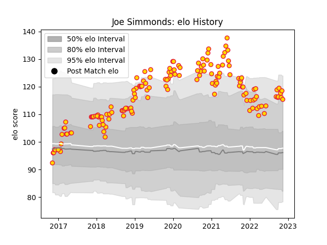

---  
layout: page  
title: Joe Simmonds  
date: 2023-02-02 18:58:06.283087  
categories: player  
---
# Joe Simmonds

## Positions: FH

## Current elo: 138.0

## Current Percentile: 96.0

# Elo History

# Match History

| Team          |   Appearances |   Win Rate |
|:--------------|--------------:|-----------:|
| Exeter Chiefs |           161 |   0.720497 |

| Opponent            |   Matches |   Win Rate |
|:--------------------|----------:|-----------:|
| Northampton Saints  |        15 |   0.733333 |
| Bath Rugby          |        14 |   0.928571 |
| Sale Sharks         |        14 |   0.857143 |
| Harlequins          |        14 |   0.642857 |
| Gloucester Rugby    |        12 |   0.75     |
| Saracens            |        12 |   0.5      |
| Newcastle Falcons   |        12 |   0.75     |
| Worcester Warriors  |        12 |   0.75     |
| Wasps               |        10 |   0.6      |
| Leicester Tigers    |        10 |   0.7      |
| Bristol Rugby       |         9 |   0.666667 |
| London Irish        |         6 |   0.666667 |
| Castres Olympique   |         4 |   0.75     |
| Glasgow Warriors    |         3 |   0.5      |
| Munster             |         2 |   0.25     |
| Bulls               |         2 |   0.5      |
| La Rochelle         |         2 |   1        |
| Montpellier Herault |         1 |   1        |
| Clermont Auvergne   |         1 |   0        |
| Racing 92           |         1 |   1        |
| Bordeaux Begles     |         1 |   1        |
| Scarlets            |         1 |   1        |
| Stade Toulousain    |         1 |   1        |
| Ulster              |         1 |   1        |
| Cardiff Blues       |         1 |   1        |