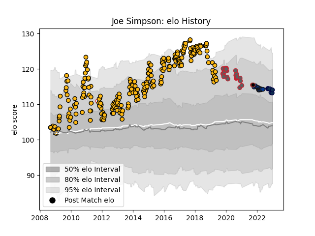

---  
layout: page  
title: Joe Simpson  
date: 2022-12-18 16:13:26.369918  
categories: player  
---
# Joe Simpson

## Positions: SH

## Country: England

## Current elo: 110.0

## Current Percentile: None

# Elo History

# Match History

| Team             |   Appearances |   Win Rate |
|:-----------------|--------------:|-----------:|
| Wasps            |           263 |   0.54943  |
| Gloucester Rugby |            27 |   0.37037  |
| Bath Rugby       |            13 |   0.423077 |
| Sale Sharks      |             6 |   0.833333 |
| Saracens         |             2 |   0.5      |
| England          |             1 |   1        |

| Opponent            |   Matches |   Win Rate |
|:--------------------|----------:|-----------:|
| Harlequins          |        28 |  0.392857  |
| Exeter Chiefs       |        25 |  0.34      |
| Bath Rugby          |        24 |  0.479167  |
| Leicester Tigers    |        23 |  0.478261  |
| Saracens            |        21 |  0.0952381 |
| Gloucester Rugby    |        20 |  0.625     |
| London Irish        |        20 |  0.7       |
| Sale Sharks         |        19 |  0.447368  |
| Northampton Saints  |        19 |  0.368421  |
| Worcester Warriors  |        19 |  0.842105  |
| Newcastle Falcons   |        16 |  0.84375   |
| Bristol Rugby       |         9 |  0.777778  |
| Leinster            |         8 |  0.4375    |
| Bayonne             |         7 |  0.785714  |
| Dragons             |         6 |  0.666667  |
| Stade Toulousain    |         6 |  0.416667  |
| Connacht            |         4 |  0.5       |
| London Welsh        |         4 |  1         |
| Leeds               |         3 |  0.666667  |
| Ulster              |         3 |  0.666667  |
| Wasps               |         3 |  0.666667  |
| Yorkshire Carnegie  |         3 |  0.666667  |
| Toulon              |         3 |  0.333333  |
| Arix Viadana        |         2 |  1         |
| Montpellier Herault |         2 |  0.5       |
| La Rochelle         |         2 |  0.5       |
| Glasgow Warriors    |         2 |  0.5       |
| Edinburgh           |         2 |  1         |
| Castres Olympique   |         2 |  0.5       |
| Bordeaux Begles     |         2 |  1         |
| Ospreys             |         1 |  1         |
| Grenoble            |         1 |  1         |
| Georgia             |         1 |  1         |
| Cardiff Blues       |         1 |  0         |
| Zebre               |         1 |  1         |