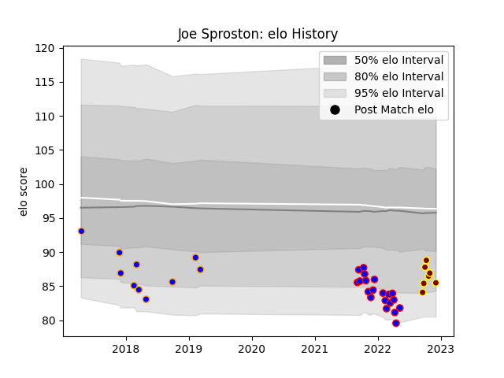

---  
layout: page  
title: Joe Sproston  
date: 2022-12-12 15:39:16.399729  
categories: player  
---
# Joe Sproston

## Positions: P

## Current elo: 85.0

## Current Percentile: 13.0

# Elo History

# Match History

| Team      |   Appearances |   Win Rate |
|:----------|--------------:|-----------:|
| Dijon     |            20 |   0.4      |
| Doncaster |            10 |   0.2      |
| Ampthill  |             7 |   0.285714 |

| Opponent                   |   Matches |   Win Rate |
|:---------------------------|----------:|-----------:|
| Ealing Trailfinders        |         3 |       0    |
| Suresnes                   |         2 |       0    |
| Bourgoin-Jallieu           |         2 |       0.5  |
| Soyaux-Angouleme           |         2 |       0.5  |
| Chambery                   |         2 |       0    |
| Cognac Saint Jean d'Angély |         2 |       0    |
| Cornish Pirates            |         2 |       0    |
| Nice                       |         2 |       0.5  |
| Aubenas                    |         2 |       0.75 |
| Hartpury College           |         2 |       0.5  |
| London Irish               |         1 |       0    |
| Tarbes                     |         1 |       0.5  |
| Richmond                   |         1 |       0    |
| Nottingham                 |         1 |       0    |
| Massy                      |         1 |       0    |
| London Scottish            |         1 |       1    |
| Albi                       |         1 |       0    |
| Jersey                     |         1 |       0    |
| Doncaster                  |         1 |       0    |
| Dax                        |         1 |       1    |
| Coventry                   |         1 |       0    |
| Caldy                      |         1 |       1    |
| Bristol Rugby              |         1 |       0    |
| Blagnac                    |         1 |       1    |
| Bedford                    |         1 |       1    |
| Valence Romans Drome Rugby |         1 |       1    |