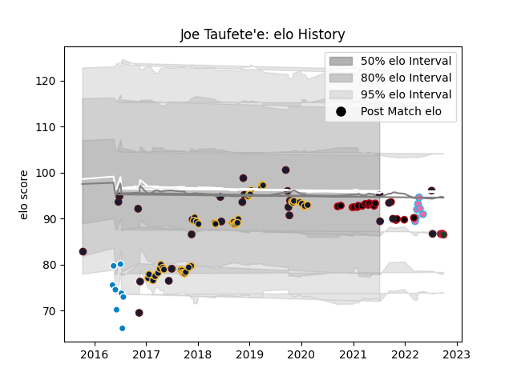

---  
layout: page  
title: Joe Taufete'e  
date: 2023-01-06 11:44:08.419753  
categories: player  
---
# Joe Taufete'e

## Positions: H, P

## Country: United States of America

## Current elo: 95.0

## Current Percentile: 44.0

# Elo History

# Match History

| Team                     |   Appearances |   Win Rate |
|:-------------------------|--------------:|-----------:|
| Worcester Warriors       |            48 |   0.291667 |
| United States of America |            26 |   0.384615 |
| Lyon                     |            18 |   0.444444 |
| San Diego                |             8 |   0.375    |
| L. A. Giltinis           |             7 |   0.857143 |
| Leicester Tigers         |             4 |   0.5      |

| Opponent             |   Matches |   Win Rate |
|:---------------------|----------:|-----------:|
| Harlequins           |         6 |   0.333333 |
| Wasps                |         5 |   0        |
| Bath Rugby           |         5 |   0.4      |
| Exeter Chiefs        |         5 |   0        |
| Newcastle Falcons    |         4 |   0.25     |
| Northampton Saints   |         4 |   0.25     |
| Brive                |         4 |   0.5      |
| Saracens             |         4 |   0        |
| Clermont Auvergne    |         3 |   0.333333 |
| Ireland              |         3 |   0        |
| Sale Sharks          |         3 |   0        |
| Canada               |         3 |   1        |
| Bristol Rugby        |         3 |   1        |
| San Francisco        |         2 |   0.5      |
| La Rochelle          |         2 |   0        |
| Sacramento           |         2 |   0.5      |
| Russia               |         2 |   1        |
| Romania              |         2 |   0.5      |
| Oyonnax              |         2 |   0.5      |
| Ohio                 |         2 |   0.5      |
| Stade Francais Paris |         2 |   0.5      |
| Tonga                |         2 |   0        |
| Toulon               |         2 |   0.5      |
| Leicester Tigers     |         2 |   0.5      |
| Montpellier Herault  |         2 |   0.5      |
| Denver               |         2 |   0        |
| Gloucester Rugby     |         2 |   0        |
| Castres Olympique    |         2 |   0.5      |
| Chile                |         2 |   0.5      |
| England              |         2 |   0        |
| Dallas Jackals       |         1 |   1        |
| Utah Warriors        |         1 |   0        |
| Uruguay              |         1 |   0        |
| Austin Gilgronis     |         1 |   1        |
| Bayonne              |         1 |   1        |
| Bordeaux Begles      |         1 |   1        |
| South Africa         |         1 |   0        |
| Seattle Seawolves    |         1 |   1        |
| Scotland             |         1 |   1        |
| San Diego Legion     |         1 |   1        |
| Samoa                |         1 |   1        |
| Italy                |         1 |   0        |
| London Irish         |         1 |   1        |
| France               |         1 |   0        |
| Racing 92            |         1 |   0        |
| RC Enisei            |         1 |   1        |
| R.U. New York        |         1 |   1        |
| Pau                  |         1 |   0        |
| Georgia              |         1 |   0        |
| Ospreys              |         1 |   1        |
| Germany              |         1 |   1        |
| Houston SaberCats    |         1 |   1        |
| New Zealand Maori    |         1 |   0        |
| Argentina            |         1 |   0        |
| Agen                 |         1 |   1        |