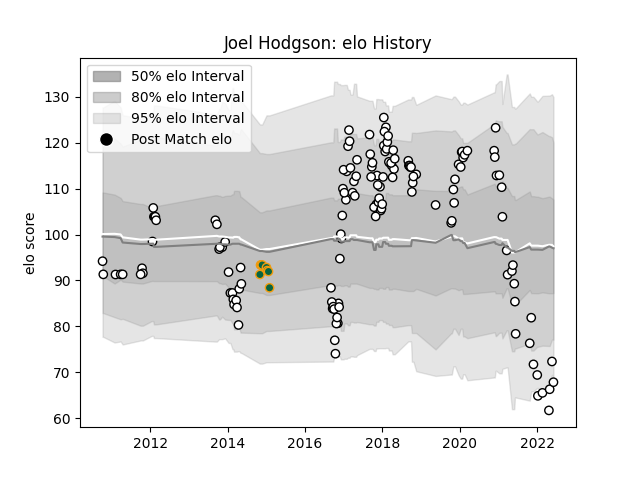

---  
layout: page  
title: Joel Hodgson  
date: 2023-03-02 11:26:20.993134  
categories: player  
---
# Joel Hodgson

## Positions: FH

## Current elo: 68.0

## Current Percentile: 7.0

# Elo History

# Match History

| Team               |   Appearances |   Win Rate |
|:-------------------|--------------:|-----------:|
| Newcastle Falcons  |           140 |   0.496429 |
| Northampton Saints |             8 |   0.625    |

| Opponent               |   Matches |   Win Rate |
|:-----------------------|----------:|-----------:|
| Leicester Tigers       |        13 |  0.0769231 |
| Exeter Chiefs          |        11 |  0.181818  |
| Saracens               |        10 |  0.1       |
| Northampton Saints     |        10 |  0.5       |
| Wasps                  |         9 |  0.333333  |
| London Irish           |         9 |  0.555556  |
| Gloucester Rugby       |         9 |  0.555556  |
| Sale Sharks            |         9 |  0.555556  |
| Bath Rugby             |         9 |  0.444444  |
| Worcester Warriors     |         8 |  0.5625    |
| Harlequins             |         7 |  0.428571  |
| Bristol Rugby          |         3 |  0.666667  |
| Brive                  |         3 |  0.333333  |
| Cardiff Blues          |         3 |  0.666667  |
| Ospreys                |         3 |  0.333333  |
| Dragons                |         3 |  1         |
| Newcastle Falcons      |         2 |  1         |
| Lyon                   |         2 |  0.5       |
| Montpellier Herault    |         2 |  0.5       |
| RC Enisei              |         2 |  1         |
| Bedford                |         2 |  1         |
| Nottingham             |         1 |  1         |
| Petrarca Padova        |         1 |  1         |
| Scarlets               |         1 |  1         |
| Toulon                 |         1 |  1         |
| Ampthill               |         1 |  1         |
| Hartpury College       |         1 |  1         |
| London Scottish        |         1 |  1         |
| Jersey                 |         1 |  1         |
| Grenoble               |         1 |  1         |
| Enisey-STM Krasnoyarsk |         1 |  1         |
| Ealing Trailfinders    |         1 |  1         |
| Doncaster              |         1 |  1         |
| Coventry               |         1 |  1         |
| Cornish Pirates        |         1 |  1         |
| Calvisano              |         1 |  1         |
| Bucuresti              |         1 |  1         |
| Bourgoin-Jallieu       |         1 |  1         |
| Bordeaux Begles        |         1 |  1         |
| Yorkshire Carnegie     |         1 |  1         |