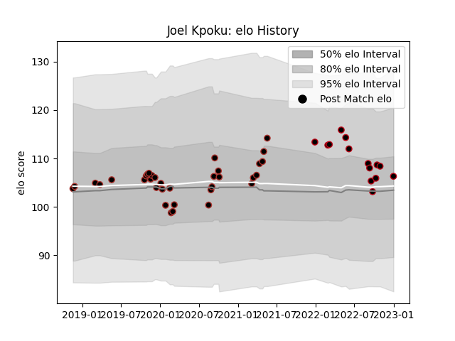

---  
layout: page  
title: Joel Kpoku  
date: 2023-01-06 00:13:30.251424  
categories: player  
---
# Joel Kpoku

## Positions: L

## Current elo: 106.0

## Current Percentile: 69.0

# Elo History

# Match History

| Team     |   Appearances |   Win Rate |
|:---------|--------------:|-----------:|
| Saracens |            34 |   0.691176 |
| Lyon     |            14 |   0.428571 |

| Opponent             |   Matches |   Win Rate |
|:---------------------|----------:|-----------:|
| La Rochelle          |         3 |   0        |
| Leicester Tigers     |         3 |   1        |
| Sale Sharks          |         3 |   0.666667 |
| Northampton Saints   |         3 |   0.666667 |
| Worcester Warriors   |         3 |   0.333333 |
| Montpellier Herault  |         2 |   1        |
| Gloucester Rugby     |         2 |   1        |
| Harlequins           |         2 |   0.5      |
| Racing 92            |         2 |   0        |
| Bordeaux Begles      |         2 |   0.5      |
| London Irish         |         2 |   1        |
| Brive                |         2 |   0.5      |
| Munster              |         2 |   0.5      |
| Ospreys              |         2 |   1        |
| Nottingham           |         1 |   1        |
| Wasps                |         1 |   0        |
| Stade Francais Paris |         1 |   1        |
| Bedford              |         1 |   1        |
| Richmond             |         1 |   1        |
| Perpignan            |         1 |   0        |
| Bristol Rugby        |         1 |   0        |
| Biarritz Olympique   |         1 |   1        |
| Bath Rugby           |         1 |   0.5      |
| Jersey               |         1 |   1        |
| Exeter Chiefs        |         1 |   1        |
| Ealing Trailfinders  |         1 |   1        |
| Cornish Pirates      |         1 |   0        |
| Clermont Auvergne    |         1 |   0        |
| Ampthill             |         1 |   1        |