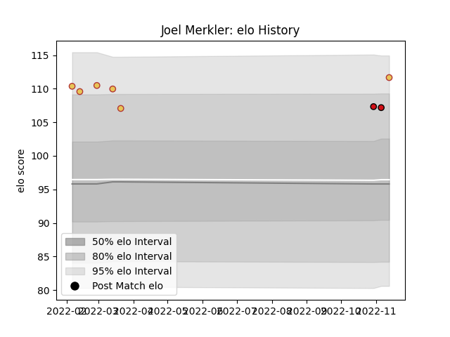

---  
layout: page  
title: Joel Merkler  
date: 2023-01-13 11:29:40.189445  
categories: player  
---
# Joel Merkler

## Positions: P

## Country: Spain

## Current elo: 102.0

## Current Percentile: 73.0

# Elo History

# Match History

| Team             |   Appearances |   Win Rate |
|:-----------------|--------------:|-----------:|
| Spain            |             9 |   0.777778 |
| Stade Toulousain |             3 |   0.166667 |

| Opponent             |   Matches |   Win Rate |
|:---------------------|----------:|-----------:|
| Netherlands          |         2 |        1   |
| Uruguay              |         2 |        0.5 |
| Bayonne              |         1 |        0   |
| Georgia              |         1 |        0   |
| La Rochelle          |         1 |        0   |
| Namibia              |         1 |        1   |
| Portugal             |         1 |        1   |
| Romania              |         1 |        1   |
| Russia               |         1 |        1   |
| Stade Francais Paris |         1 |        0.5 |