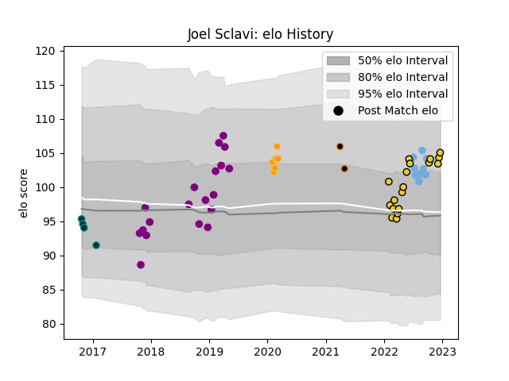

---  
layout: page  
title: Joel Sclavi  
date: 2022-12-09 13:09:25.163498  
categories: player  
---
# Joel Sclavi

## Positions: P

## Country: Argentina

## Current elo: 103.0

## Current Percentile: 75.0

# Elo History

# Match History

| Team             |   Appearances |   Win Rate |
|:-----------------|--------------:|-----------:|
| Soyaux-Angouleme |            19 |   0.447368 |
| La Rochelle      |            16 |   0.5625   |
| Argentina        |             9 |   0.444444 |
| Jaguares         |             6 |   0.5      |
| Pau              |             4 |   0        |
| Jaguares XV      |             2 |   1        |

| Opponent             |   Matches |   Win Rate |
|:---------------------|----------:|-----------:|
| Bayonne              |         3 |   0        |
| Scotland             |         3 |   0.666667 |
| Stade Toulousain     |         3 |   0        |
| Carcassonne          |         3 |   0.666667 |
| South Africa         |         2 |   0        |
| Stade Francais Paris |         2 |   0.5      |
| New Zealand          |         2 |   0.5      |
| Australia            |         2 |   0.5      |
| Mont-de-Marsan       |         2 |   0.5      |
| Massy                |         2 |   0.75     |
| Olimpia Lions        |         2 |   1        |
| Toulon               |         2 |   0.5      |
| Biarritz Olympique   |         2 |   0        |
| Beziers              |         2 |   1        |
| Pau                  |         1 |   1        |
| Sharks               |         1 |   0        |
| Stormers             |         1 |   0        |
| Racing 92            |         1 |   1        |
| Queensland Reds      |         1 |   1        |
| Provence Rugby       |         1 |   1        |
| Perpignan            |         1 |   1        |
| US Bressane          |         1 |   1        |
| Aurillac             |         1 |   0        |
| Montpellier Herault  |         1 |   0        |
| Oyonnax              |         1 |   0        |
| Nevers               |         1 |   0        |
| Montauban            |         1 |   0        |
| Lyon                 |         1 |   1        |
| Lions                |         1 |   1        |
| La Rochelle          |         1 |   0        |
| Hurricanes           |         1 |   0        |
| Clermont Auvergne    |         1 |   1        |
| Cardiff Blues        |         1 |   0        |
| Bulls                |         1 |   1        |
| Brive                |         1 |   1        |
| Bordeaux Begles      |         1 |   1        |
| Bath Rugby           |         1 |   0        |
| Vannes               |         1 |   0        |