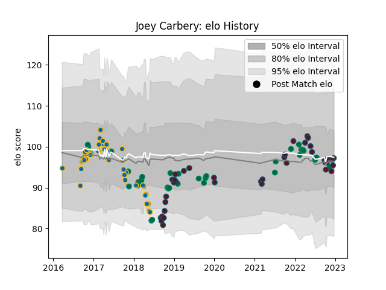

---  
layout: page  
title: Joey Carbery  
date: 2023-02-02 18:52:05.254977  
categories: player  
---
# Joey Carbery

## Positions: FH, FB

## Country: Ireland

## Current elo: 104.0

## Current Percentile: 65.0

# Elo History

# Match History

| Team     |   Appearances |   Win Rate |
|:---------|--------------:|-----------:|
| Munster  |            42 |   0.607143 |
| Ireland  |            40 |   0.825    |
| Leinster |            38 |   0.736842 |

| Opponent                 |   Matches |   Win Rate |
|:-------------------------|----------:|-----------:|
| Leinster                 |         8 |   0.125    |
| New Zealand              |         7 |   0.714286 |
| Connacht                 |         7 |   0.714286 |
| Scarlets                 |         5 |   0.8      |
| Cardiff Blues            |         5 |   0.8      |
| Ulster                   |         5 |   0.4      |
| Edinburgh                |         5 |   1        |
| Glasgow Warriors         |         5 |   0.4      |
| Benetton Treviso         |         4 |   0.75     |
| Italy                    |         4 |   1        |
| Ospreys                  |         4 |   0.75     |
| Munster                  |         3 |   1        |
| Australia                |         3 |   0.666667 |
| Japan                    |         3 |   0.666667 |
| Montpellier Herault      |         3 |   0.666667 |
| Scotland                 |         3 |   1        |
| Northampton Saints       |         3 |   1        |
| Dragons                  |         3 |   0.666667 |
| United States of America |         3 |   1        |
| England                  |         3 |   0.666667 |
| South Africa             |         2 |   1        |
| Stade Toulousain         |         2 |   0        |
| Wales                    |         2 |   1        |
| Wasps                    |         2 |   1        |
| Argentina                |         2 |   1        |
| New Zealand Maori        |         2 |   0.5      |
| Fiji                     |         2 |   1        |
| Castres Olympique        |         2 |   0.5      |
| Cheetahs                 |         2 |   0.5      |
| Gloucester Rugby         |         2 |   1        |
| Exeter Chiefs            |         2 |   0.75     |
| France                   |         2 |   0.5      |
| Sharks                   |         1 |   1        |
| Saracens                 |         1 |   1        |
| Southern Kings           |         1 |   1        |
| Clermont Auvergne        |         1 |   0        |
| Stormers                 |         1 |   1        |
| Samoa                    |         1 |   1        |
| Racing 92                |         1 |   1        |
| Canada                   |         1 |   1        |
| Bulls                    |         1 |   1        |
| Zebre                    |         1 |   1        |