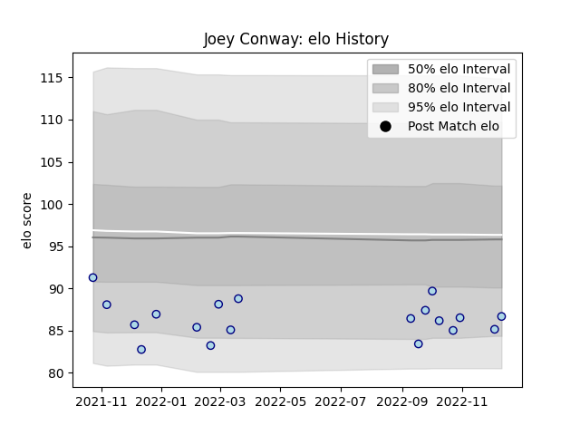

---  
layout: page  
title: Joey Conway  
date: 2022-12-18 16:13:40.163828  
categories: player  
---
# Joey Conway

## Positions: P

## Current elo: 87.0

## Current Percentile: 11.0

# Elo History

# Match History

| Team    |   Appearances |   Win Rate |
|:--------|--------------:|-----------:|
| Bedford |            19 |   0.473684 |

| Opponent            |   Matches |   Win Rate |
|:--------------------|----------:|-----------:|
| Coventry            |         3 |        0   |
| London Scottish     |         3 |        1   |
| Cornish Pirates     |         2 |        0.5 |
| Doncaster           |         2 |        0   |
| Ealing Trailfinders |         2 |        0   |
| Nottingham          |         2 |        1   |
| Richmond            |         2 |        0   |
| Caldy               |         1 |        1   |
| Hartpury College    |         1 |        1   |
| Jersey              |         1 |        1   |