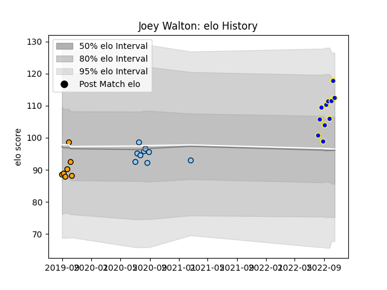

---  
layout: page  
title: Joey Walton  
date: 2023-03-24 11:47:03.106830  
categories: player  
---
# Joey Walton

Last updated: 2023-03-24
## Positions: C

## Current elo: 112.0

## Current Percentile: 88.0

# Elo History

# Match History

| Team                     |   Appearances |   Win Rate |
|:-------------------------|--------------:|-----------:|
| Bay of Plenty            |            11 |   0.636364 |
| New South Wales Waratahs |             9 |   0.444444 |
| NSW Country Eagles       |             7 |   0.5      |

| Opponent           |   Matches |   Win Rate |
|:-------------------|----------:|-----------:|
| Western Force      |         3 |   1        |
| Queensland Reds    |         3 |   0.333333 |
| Brumbies           |         2 |   0        |
| Waikato            |         2 |   0.5      |
| Melbourne Rebels   |         2 |   0.5      |
| Otago              |         1 |   1        |
| Wellington         |         1 |   0        |
| Taranaki           |         1 |   1        |
| Sydney Rays        |         1 |   1        |
| Southland          |         1 |   1        |
| Queensland Country |         1 |   0        |
| Auckland           |         1 |   1        |
| Brisbane City      |         1 |   0        |
| Melbourne Rising   |         1 |   1        |
| Hawke's Bay        |         1 |   1        |
| Fijian Drua        |         1 |   0.5      |
| Counties Manukau   |         1 |   0        |
| Canterbury         |         1 |   0        |
| Canberra Vikings   |         1 |   0        |
| North Harbour      |         1 |   1        |