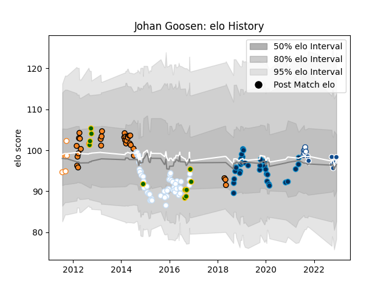

---  
layout: page  
title: Johan Goosen  
date: 2023-02-02 18:59:30.361893  
categories: player  
---
# Johan Goosen

## Positions: FH, FB

## Country: South Africa

## Current elo: 88.0

## Current Percentile: 24.0

# Elo History

# Match History

| Team                |   Appearances |   Win Rate |
|:--------------------|--------------:|-----------:|
| Racing 92           |            53 |   0.698113 |
| Montpellier Herault |            33 |   0.469697 |
| Cheetahs            |            30 |   0.316667 |
| Bulls               |            14 |   0.5      |
| South Africa        |            12 |   0.333333 |
| Free State Cheetahs |            10 |   0.7      |
| Blue Bulls          |             7 |   0.857143 |

| Opponent                 |   Matches |   Win Rate |
|:-------------------------|----------:|-----------:|
| Stade Toulousain         |         9 |   0.555556 |
| Toulon                   |         9 |   0.777778 |
| Bordeaux Begles          |         6 |   0.5      |
| Clermont Auvergne        |         6 |   0.416667 |
| Montpellier Herault      |         5 |   0.7      |
| La Rochelle              |         4 |   0.5      |
| Northampton Saints       |         4 |   0.875    |
| Grenoble                 |         4 |   0.5      |
| Scarlets                 |         4 |   0.5      |
| Stade Francais Paris     |         4 |   0.625    |
| Castres Olympique        |         4 |   0.25     |
| Sharks                   |         4 |   0.5      |
| Lions                    |         4 |   0.25     |
| Bayonne                  |         4 |   0.75     |
| Chiefs                   |         3 |   0.166667 |
| Australia                |         3 |   0.333333 |
| New Zealand              |         3 |   0        |
| Griquas                  |         3 |   0.666667 |
| Golden Lions             |         3 |   0.833333 |
| Bulls                    |         3 |   0.333333 |
| Blue Bulls               |         3 |   0.5      |
| Lyon                     |         3 |   0.333333 |
| Brive                    |         3 |   0.666667 |
| Connacht                 |         3 |   0.666667 |
| Oyonnax                  |         3 |   0.666667 |
| Pumas                    |         2 |   1        |
| Perpignan                |         2 |   0.5      |
| Pau                      |         2 |   1        |
| Saracens                 |         2 |   0        |
| Wales                    |         2 |   0.5      |
| Ospreys                  |         2 |   0.75     |
| Natal Sharks             |         2 |   0.5      |
| Munster                  |         2 |   0        |
| Stormers                 |         2 |   0        |
| Melbourne Rebels         |         2 |   0.5      |
| Western Province         |         2 |   1        |
| Edinburgh                |         2 |   0.5      |
| Leicester Tigers         |         2 |   0.5      |
| Argentina                |         2 |   0.5      |
| Hurricanes               |         2 |   0.5      |
| Highlanders              |         2 |   0.5      |
| Brumbies                 |         2 |   0.5      |
| Cardiff Blues            |         2 |   1        |
| Crusaders                |         2 |   0        |
| Leopards                 |         1 |   1        |
| Western Force            |         1 |   0        |
| Benetton Treviso         |         1 |   1        |
| Blues                    |         1 |   0        |
| Southern Kings           |         1 |   1        |
| Dragons                  |         1 |   1        |
| Exeter Chiefs            |         1 |   1        |
| England                  |         1 |   0        |
| Queensland Reds          |         1 |   0        |
| Leinster                 |         1 |   0        |
| Free State Cheetahs      |         1 |   1        |
| Glasgow Warriors         |         1 |   1        |
| Gloucester Rugby         |         1 |   0        |
| Newcastle Falcons        |         1 |   1        |
| Italy                    |         1 |   1        |
| New South Wales Waratahs |         1 |   1        |
| Agen                     |         1 |   1        |