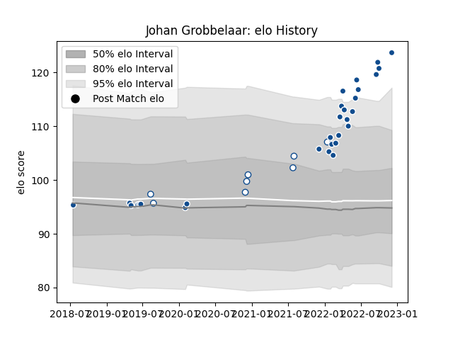

---  
layout: page  
title: Johan Grobbelaar  
date: 2022-12-09 13:24:50.244728  
categories: player  
---
# Johan Grobbelaar

## Positions: H

## Current elo: 124.0

## Current Percentile: 97.0

# Elo History

# Match History

| Team       |   Appearances |   Win Rate |
|:-----------|--------------:|-----------:|
| Bulls      |            29 |   0.637931 |
| Blue Bulls |             8 |   0.75     |

| Opponent                 |   Matches |   Win Rate |
|:-------------------------|----------:|-----------:|
| Lions                    |         5 |       0.8  |
| Stormers                 |         5 |       0    |
| Sharks                   |         4 |       0.25 |
| Western Province         |         2 |       1    |
| Golden Lions             |         2 |       1    |
| Natal Sharks             |         2 |       0    |
| Munster                  |         1 |       1    |
| Ulster                   |         1 |       1    |
| Scarlets                 |         1 |       1    |
| Pumas                    |         1 |       1    |
| Ospreys                  |         1 |       1    |
| New South Wales Waratahs |         1 |       1    |
| Benetton Treviso         |         1 |       1    |
| Cardiff Blues            |         1 |       1    |
| Leinster                 |         1 |       1    |
| Hurricanes               |         1 |       0    |
| Highlanders              |         1 |       0.5  |
| Glasgow Warriors         |         1 |       1    |
| Free State Cheetahs      |         1 |       1    |
| Edinburgh                |         1 |       1    |
| Dragons                  |         1 |       1    |
| Connacht                 |         1 |       1    |
| Zebre                    |         1 |       1    |