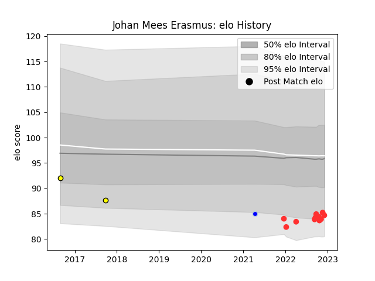

---  
layout: page  
title: Johan Mees Erasmus  
date: 2023-01-17 11:43:12.839974  
categories: player  
---
# Johan Mees Erasmus

## Positions: P

## Current elo: 108.0

## Current Percentile: 79.0

# Elo History

# Match History

| Team             |   Appearances |   Win Rate |
|:-----------------|--------------:|-----------:|
| Tarbes           |            27 |   0.5      |
| Perth Spirit     |             9 |   0.666667 |
| Melbourne Rising |             5 |   0.4      |
| Colomiers        |             3 |   0.666667 |

| Opponent                   |   Matches |   Win Rate |
|:---------------------------|----------:|-----------:|
| Dax                        |         3 |   0.333333 |
| Cognac Saint Jean d'Angély |         3 |   1        |
| Albi                       |         2 |   0.5      |
| Suresnes                   |         2 |   0        |
| Melbourne Rising           |         2 |   1        |
| Massy                      |         2 |   0        |
| Greater Sydney Rams        |         2 |   1        |
| Dijon                      |         2 |   0.75     |
| Fijian Drua                |         2 |   0        |
| Chambery                   |         2 |   1        |
| Canberra Vikings           |         2 |   0        |
| Brisbane City              |         2 |   0.5      |
| Bourgoin-Jallieu           |         2 |   1        |
| Blagnac                    |         2 |   0        |
| Queensland Country         |         1 |   1        |
| Valence Romans Drome Rugby |         1 |   0        |
| US Bressane                |         1 |   0        |
| Sydney Rays                |         1 |   1        |
| Soyaux-Angouleme           |         1 |   0        |
| Rennes                     |         1 |   1        |
| NSW Country Eagles         |         1 |   1        |
| Provence Rugby             |         1 |   1        |
| Oyonnax                    |         1 |   1        |
| North Harbour Rays         |         1 |   0        |
| Nice                       |         1 |   0        |
| Narbonne                   |         1 |   1        |
| Aubenas                    |         1 |   1        |
| Vannes                     |         1 |   0        |