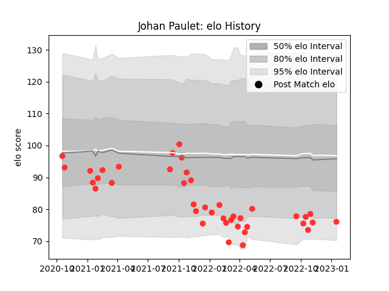

---  
layout: page  
title: Johan Paulet  
date: 2023-02-02 19:12:42.596233  
categories: player  
---
# Johan Paulet

## Positions: W, C

## Current elo: 83.0

## Current Percentile: 8.0

# Elo History

# Match History

| Team   |   Appearances |   Win Rate |
|:-------|--------------:|-----------:|
| Tarbes |            41 |   0.439024 |

| Opponent                   |   Matches |   Win Rate |
|:---------------------------|----------:|-----------:|
| Blagnac                    |         4 |   0.25     |
| Suresnes                   |         4 |   0.25     |
| Cognac Saint Jean d'Angély |         4 |   0.875    |
| Nice                       |         4 |   0        |
| Bourgoin-Jallieu           |         3 |   1        |
| Dax                        |         3 |   0.333333 |
| Massy                      |         3 |   0        |
| Albi                       |         2 |   0.5      |
| Narbonne                   |         2 |   0.5      |
| Soyaux-Angouleme           |         2 |   0.5      |
| Dijon                      |         2 |   0.75     |
| Chambery                   |         2 |   0.5      |
| Valence Romans Drome Rugby |         2 |   0.5      |
| Aubenas                    |         1 |   1        |
| Rennes                     |         1 |   1        |
| Carqueiranne-Hyères        |         1 |   0        |
| US Bressane                |         1 |   0        |