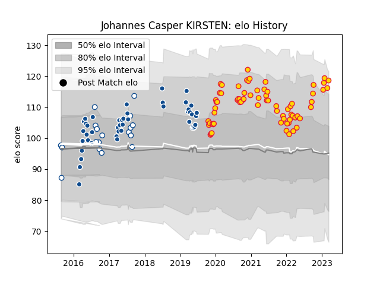

---  
layout: page  
title: Johannes Casper KIRSTEN  
date: 2023-01-23 15:35:41.337521  
categories: player  
---
# Johannes Casper KIRSTEN

## Positions: FL, L

## Current elo: 116.0

## Current Percentile: 83.0

# Elo History

# Match History

| Team          |   Appearances |   Win Rate |
|:--------------|--------------:|-----------:|
| Exeter Chiefs |            63 |   0.753968 |
| Bulls         |            45 |   0.5      |
| Blue Bulls    |            16 |   0.625    |

| Opponent                 |   Matches |   Win Rate |
|:-------------------------|----------:|-----------:|
| Bath Rugby               |         7 |   0.857143 |
| Sale Sharks              |         7 |   0.857143 |
| Harlequins               |         6 |   0.5      |
| Northampton Saints       |         6 |   0.833333 |
| Leicester Tigers         |         6 |   0.833333 |
| Sunwolves                |         5 |   0.6      |
| Bristol Rugby            |         5 |   0.6      |
| Lions                    |         5 |   0.4      |
| Jaguares                 |         4 |   0.5      |
| Sharks                   |         4 |   0.875    |
| Gloucester Rugby         |         4 |   1        |
| Griquas                  |         4 |   1        |
| London Irish             |         3 |   0.666667 |
| Western Province         |         3 |   0.666667 |
| Wasps                    |         3 |   0.666667 |
| Stormers                 |         3 |   0.333333 |
| Saracens                 |         3 |   0.666667 |
| Newcastle Falcons        |         3 |   0.666667 |
| Worcester Warriors       |         3 |   0.666667 |
| Cheetahs                 |         3 |   1        |
| Hurricanes               |         2 |   0        |
| Golden Lions             |         2 |   0.5      |
| Chiefs                   |         2 |   0        |
| Crusaders                |         2 |   0        |
| Southern Kings           |         2 |   0.5      |
| Free State Cheetahs      |         2 |   0.5      |
| Glasgow Warriors         |         2 |   0.75     |
| La Rochelle              |         2 |   1        |
| Queensland Reds          |         2 |   1        |
| Brumbies                 |         2 |   0        |
| New South Wales Waratahs |         2 |   0.5      |
| Natal Sharks             |         2 |   0        |
| Melbourne Rebels         |         2 |   1        |
| Highlanders              |         2 |   0.25     |
| Blues                    |         2 |   0.25     |
| Pumas                    |         1 |   0        |
| Racing 92                |         1 |   1        |
| Boland Cavaliers         |         1 |   1        |
| Eastern Province Kings   |         1 |   1        |
| Castres Olympique        |         1 |   1        |
| Western Force            |         1 |   1        |
| Bulls                    |         1 |   0        |