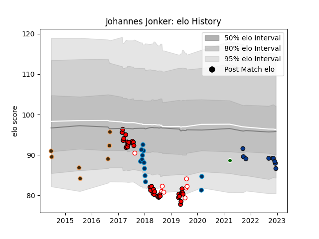

---  
layout: page  
title: Johannes Jonker  
date: 2022-12-18 16:30:55.561037  
categories: player  
---
# Johannes Jonker

## Positions: P

## Current elo: 87.0

## Current Percentile: None

# Elo History

# Match History

| Team                |   Appearances |   Win Rate |
|:--------------------|--------------:|-----------:|
| Lions               |            36 |   0.638889 |
| Montpellier Herault |            12 |   0.5      |
| Bath Rugby          |             9 |   0.222222 |
| Golden Lions        |             8 |   0.625    |
| Border Bulldogs     |             7 |   0.285714 |
| Ealing Trailfinders |             1 |   1        |

| Opponent                 |   Matches |   Win Rate |
|:-------------------------|----------:|-----------:|
| Sharks                   |         4 |   0.5      |
| Jaguares                 |         4 |   0.5      |
| Stormers                 |         3 |   1        |
| Brumbies                 |         3 |   0.666667 |
| Bulls                    |         3 |   0.666667 |
| Crusaders                |         3 |   0        |
| New South Wales Waratahs |         3 |   1        |
| Glasgow Warriors         |         3 |   0.666667 |
| Hurricanes               |         3 |   0.333333 |
| Blue Bulls               |         2 |   0.5      |
| Highlanders              |         2 |   0.5      |
| Valke                    |         2 |   0.5      |
| Stade Toulousain         |         2 |   0.5      |
| Queensland Reds          |         2 |   0.5      |
| Newcastle Falcons        |         2 |   0.5      |
| Natal Sharks             |         2 |   0        |
| Leopards                 |         2 |   0        |
| Harlequins               |         1 |   0        |
| Griquas                  |         1 |   1        |
| Western Force            |         1 |   1        |
| Wasps                    |         1 |   0        |
| Bristol Rugby            |         1 |   0        |
| Toulon                   |         1 |   0        |
| Sunwolves                |         1 |   1        |
| Brive                    |         1 |   0        |
| Cheetahs                 |         1 |   1        |
| Stade Francais Paris     |         1 |   1        |
| Southern Kings           |         1 |   1        |
| Chiefs                   |         1 |   1        |
| Sale Sharks              |         1 |   0        |
| SWD Eagles               |         1 |   0        |
| Racing 92                |         1 |   0        |
| Clermont Auvergne        |         1 |   1        |
| Pumas                    |         1 |   1        |
| Pau                      |         1 |   0        |
| Coventry                 |         1 |   1        |
| Exeter Chiefs            |         1 |   0        |
| Free State Cheetahs      |         1 |   1        |
| Melbourne Rebels         |         1 |   1        |
| Lyon                     |         1 |   1        |
| Boland Cavaliers         |         1 |   0        |
| Leicester Tigers         |         1 |   1        |
| La Rochelle              |         1 |   0        |
| Griffons                 |         1 |   1        |
| Western Province         |         1 |   1        |