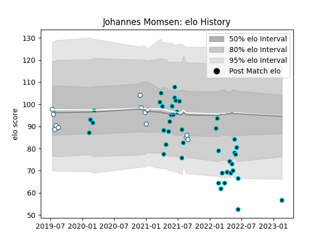

---  
layout: page  
title: Johannes Momsen  
date: 2023-03-21 18:39:01.359040  
categories: player  
---
# Johannes Momsen

Last updated: 2023-03-21
## Positions: L, N8

## Current elo: 52.0

## Current Percentile: 2.0

# Elo History

# Match History

| Team      |   Appearances |   Win Rate |
|:----------|--------------:|-----------:|
| Rugby ATL |            45 |   0.6      |
| Griquas   |            13 |   0.423077 |

| Opponent               |   Matches |   Win Rate |
|:-----------------------|----------:|-----------:|
| NOLA Gold              |         7 |   1        |
| Rugby New York         |         6 |   0.333333 |
| R.U. New York          |         6 |   0.333333 |
| Toronto Arrows         |         5 |   0.8      |
| Old Glory DC           |         4 |   0.5      |
| Pumas                  |         3 |   0.5      |
| Utah Warriors          |         3 |   0.666667 |
| San Diego Legion       |         3 |   0.666667 |
| Western Province       |         3 |   0.666667 |
| New England Free Jacks |         3 |   0.333333 |
| L. A. Giltinis         |         3 |   0.333333 |
| Free State Cheetahs    |         3 |   0        |
| Natal Sharks           |         2 |   0.5      |
| Houston SaberCats      |         2 |   1        |
| Seattle Seawolves      |         2 |   0.5      |
| Blue Bulls             |         1 |   1        |
| Golden Lions           |         1 |   0        |
| Austin Gilgronis       |         1 |   1        |