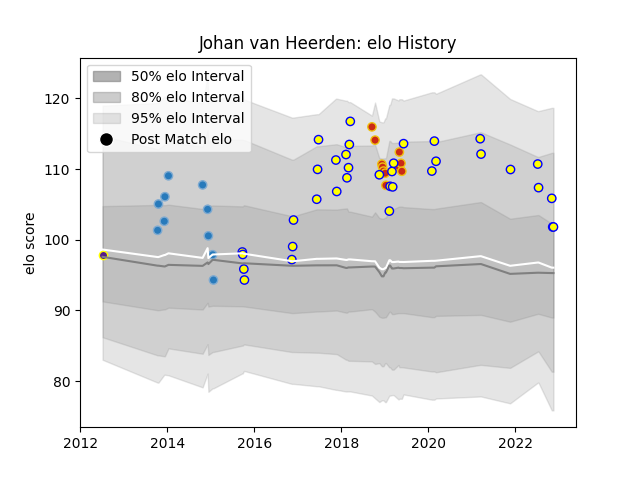

---  
layout: page  
title: Johan van Heerden  
date: 2022-11-22 11:45:24.327383  
categories: player  
---
# Johan van Heerden

## Positions: L, FL

## Country: Romania

## Current elo: 102.0

## Current Percentile: 74.0

# Elo History

# Match History

| Team      |   Appearances |   Win Rate |
|:----------|--------------:|-----------:|
| Romania   |            35 |   0.571429 |
| Perpignan |            11 |   0        |
| Bucuresti |            10 |   0.2      |
| Griffons  |             1 |   1        |

| Opponent                 |   Matches |   Win Rate |
|:-------------------------|----------:|-----------:|
| Uruguay                  |         4 |   0.5      |
| Spain                    |         4 |   0.5      |
| Stade Francais Paris     |         3 |   0        |
| Canada                   |         3 |   1        |
| Russia                   |         3 |   0.666667 |
| Georgia                  |         3 |   0        |
| La Rochelle              |         2 |   0        |
| United States of America |         2 |   0.5      |
| Tonga                    |         2 |   0.5      |
| Samoa                    |         2 |   0.5      |
| Racing 92                |         2 |   0        |
| Newcastle Falcons        |         2 |   0        |
| Belgium                  |         2 |   1        |
| Connacht                 |         2 |   0        |
| Germany                  |         2 |   1        |
| Brive                    |         2 |   0        |
| Calvisano                |         2 |   1        |
| Dragons                  |         2 |   0        |
| Chile                    |         2 |   1        |
| Clermont Auvergne        |         1 |   0        |
| Brazil                   |         1 |   1        |
| Stade Toulousain         |         1 |   0        |
| Ireland                  |         1 |   0        |
| Sale Sharks              |         1 |   0        |
| Italy                    |         1 |   0        |
| Portugal                 |         1 |   1        |
| France                   |         1 |   0        |
| Leopards                 |         1 |   1        |
| Bordeaux Begles          |         1 |   0        |
| Japan                    |         1 |   0        |