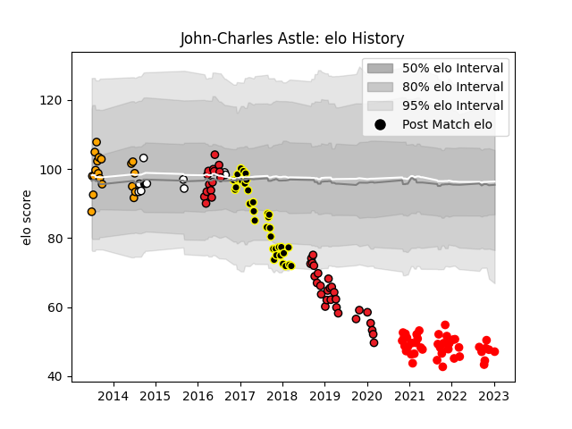

---  
layout: page  
title: John-Charles Astle  
date: 2023-01-13 11:31:55.981272  
categories: player  
---
# John-Charles Astle

## Positions: L

## Current elo: 47.0

## Current Percentile: 0.0

# Elo History

# Match History

| Team             |   Appearances |   Win Rate |
|:-----------------|--------------:|-----------:|
| Rouen            |            44 |   0.397727 |
| Southern Kings   |            43 |   0.104651 |
| Mont-de-Marsan   |            35 |   0.514286 |
| Boland Cavaliers |            19 |   0.447368 |
| Natal Sharks     |            12 |   0.833333 |

| Opponent                   |   Matches |   Win Rate |
|:---------------------------|----------:|-----------:|
| Grenoble                   |         7 |   0.285714 |
| Carcassonne                |         7 |   0.285714 |
| Oyonnax                    |         6 |   0.5      |
| Beziers                    |         6 |   0.666667 |
| Colomiers                  |         6 |   0.166667 |
| Cheetahs                   |         5 |   0        |
| Soyaux-Angouleme           |         5 |   0.6      |
| Pumas                      |         5 |   0.4      |
| Montauban                  |         5 |   0.6      |
| Aurillac                   |         5 |   0.4      |
| Biarritz Olympique         |         5 |   0.4      |
| Nevers                     |         4 |   0.25     |
| Mont-de-Marsan             |         4 |   0.25     |
| Griffons                   |         3 |   0.5      |
| Eastern Province Kings     |         3 |   1        |
| Narbonne                   |         3 |   0.666667 |
| Edinburgh                  |         3 |   0.333333 |
| Agen                       |         3 |   0.333333 |
| Scarlets                   |         3 |   0        |
| SWD Eagles                 |         3 |   0.666667 |
| Massy                      |         3 |   0.666667 |
| Border Bulldogs            |         3 |   0.666667 |
| Valke                      |         3 |   0.666667 |
| Benetton Treviso           |         3 |   0        |
| Leopards                   |         3 |   0        |
| Provence Rugby             |         2 |   0.5      |
| Sharks                     |         2 |   0        |
| Ulster                     |         2 |   0        |
| Valence Romans Drome Rugby |         2 |   0.5      |
| Munster                    |         2 |   0        |
| Vannes                     |         2 |   1        |
| Jaguares                   |         2 |   0.5      |
| Lions                      |         2 |   0        |
| Dragons                    |         2 |   0.25     |
| Blue Bulls                 |         2 |   1        |
| Cardiff Blues              |         2 |   0        |
| Leinster                   |         2 |   0        |
| Dax                        |         2 |   0.5      |
| Connacht                   |         2 |   0        |
| Golden Lions               |         2 |   0.5      |
| Griquas                    |         2 |   0.5      |
| Glasgow Warriors           |         1 |   1        |
| US Bressane                |         1 |   0.5      |
| Western Province           |         1 |   1        |
| Hurricanes                 |         1 |   0        |
| Blues                      |         1 |   0        |
| Boland Cavaliers           |         1 |   1        |
| Bulls                      |         1 |   0        |
| Stormers                   |         1 |   0        |
| Sunwolves                  |         1 |   1        |
| Perpignan                  |         1 |   1        |
| Highlanders                |         1 |   0        |
| Chiefs                     |         1 |   0        |
| Crusaders                  |         1 |   0        |
| Ospreys                    |         1 |   0        |
| Zebre                      |         1 |   0        |