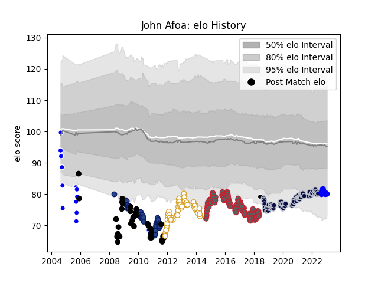

---  
layout: page  
title: John Afoa  
date: 2022-11-22 11:42:30.007489  
categories: player  
---
# John Afoa

## Positions: P

## Country: Barbarians

## Current elo: 93.0

## Current Percentile: 39.0

# Elo History

# Match History

| Team             |   Appearances |   Win Rate |
|:-----------------|--------------:|-----------:|
| Gloucester Rugby |           103 |   0.533981 |
| Bristol Rugby    |            77 |   0.577922 |
| Ulster           |            57 |   0.798246 |
| Blues            |            41 |   0.573171 |
| New Zealand      |            21 |   0.714286 |
| Auckland         |            16 |   0.53125  |
| Vannes           |            10 |   0.6      |
| Barbarians       |             1 |   1        |
| Munster          |             1 |   1        |

| Opponent                 |   Matches |   Win Rate |
|:-------------------------|----------:|-----------:|
| Northampton Saints       |        16 |   0.40625  |
| Wasps                    |        15 |   0.233333 |
| Harlequins               |        15 |   0.433333 |
| Leicester Tigers         |        14 |   0.5      |
| Sale Sharks              |        14 |   0.607143 |
| Newcastle Falcons        |        14 |   0.642857 |
| Exeter Chiefs            |        14 |   0.5      |
| Saracens                 |        13 |   0.307692 |
| Worcester Warriors       |        12 |   0.625    |
| Bath Rugby               |        12 |   0.5      |
| London Irish             |         9 |   0.777778 |
| Edinburgh                |         8 |   0.875    |
| Cardiff Blues            |         7 |   0.571429 |
| South Africa             |         7 |   0.428571 |
| Gloucester Rugby         |         7 |   0.714286 |
| Zebre                    |         7 |   0.857143 |
| Benetton Treviso         |         7 |   0.928571 |
| Australia                |         7 |   0.714286 |
| Scarlets                 |         5 |   0.8      |
| Connacht                 |         5 |   1        |
| Munster                  |         4 |   1        |
| Dragons                  |         4 |   0.75     |
| Queensland Reds          |         4 |   0.5      |
| Glasgow Warriors         |         4 |   0.75     |
| New South Wales Waratahs |         4 |   0.5      |
| Crusaders                |         4 |   0.25     |
| Chiefs                   |         4 |   0.5      |
| Cheetahs                 |         3 |   0.666667 |
| Leinster                 |         3 |   0.333333 |
| Ospreys                  |         3 |   1        |
| Sharks                   |         3 |   0        |
| Otago                    |         3 |   1        |
| Highlanders              |         3 |   1        |
| Hurricanes               |         3 |   0.666667 |
| Oyonnax                  |         3 |   0.666667 |
| Lions                    |         3 |   1        |
| Western Force            |         3 |   0.833333 |
| La Rochelle              |         3 |   0.666667 |
| Aironi                   |         3 |   1        |
| Northland                |         2 |   1        |
| Waikato                  |         2 |   0.5      |
| Stormers                 |         2 |   0.5      |
| Bayonne                  |         2 |   1        |
| Canterbury               |         2 |   0        |
| Southland                |         2 |   0.5      |
| Stade Francais Paris     |         2 |   0.5      |
| Scotland                 |         2 |   1        |
| Agen                     |         2 |   0.5      |
| Castres Olympique        |         2 |   1        |
| Clermont Auvergne        |         2 |   0.5      |
| Bulls                    |         2 |   0.5      |
| London Welsh             |         2 |   1        |
| Brumbies                 |         2 |   0.5      |
| Ireland                  |         2 |   1        |
| Brive                    |         2 |   1        |
| Nevers                   |         1 |   1        |
| Grenoble                 |         1 |   1        |
| Argentina                |         1 |   1        |
| Wellington               |         1 |   1        |
| Toulon                   |         1 |   1        |
| Taranaki                 |         1 |   0        |
| England                  |         1 |   1        |
| Soyaux-Angouleme         |         1 |   0        |
| Bay of Plenty            |         1 |   0        |
| Bristol Rugby            |         1 |   1        |
| Montpellier Herault      |         1 |   1        |
| Hawke's Bay              |         1 |   0.5      |
| Italy                    |         1 |   1        |
| Rouen                    |         1 |   0        |
| Japan                    |         1 |   1        |
| Pau                      |         1 |   0        |
| Bordeaux Begles          |         1 |   1        |
| Massy                    |         1 |   1        |
| Melbourne Rebels         |         1 |   1        |
| Beziers                  |         1 |   1        |
| North Harbour            |         1 |   0        |
| Biarritz Olympique       |         1 |   1        |
| Carcassonne              |         1 |   1        |