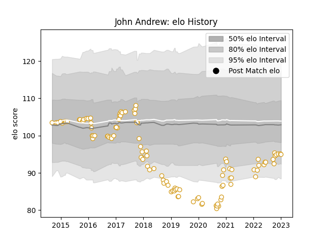

---  
layout: page  
title: John Andrew  
date: 2022-12-31 16:29:30.796634  
categories: player  
---
# John Andrew

## Positions: H

## Current elo: 85.0

## Current Percentile: 10.0

# Elo History

# Match History

| Team   |   Appearances |   Win Rate |
|:-------|--------------:|-----------:|
| Ulster |           111 |   0.675676 |

| Opponent         |   Matches |   Win Rate |
|:-----------------|----------:|-----------:|
| Scarlets         |        12 |   0.541667 |
| Leinster         |        11 |   0.272727 |
| Dragons          |        10 |   0.85     |
| Edinburgh        |         9 |   0.666667 |
| Benetton Treviso |         8 |   0.9375   |
| Ospreys          |         8 |   0.875    |
| Zebre            |         8 |   0.875    |
| Connacht         |         8 |   0.75     |
| Cardiff Blues    |         8 |   0.75     |
| Munster          |         7 |   0.428571 |
| Glasgow Warriors |         6 |   0.666667 |
| Cheetahs         |         3 |   0.833333 |
| Southern Kings   |         3 |   1        |
| Harlequins       |         2 |   1        |
| Exeter Chiefs    |         1 |   0        |
| Bordeaux Begles  |         1 |   0        |
| Sharks           |         1 |   1        |
| Stade Toulousain |         1 |   0        |
| Stormers         |         1 |   0        |
| Toulon           |         1 |   0        |
| Wasps            |         1 |   1        |
| Lions            |         1 |   1        |