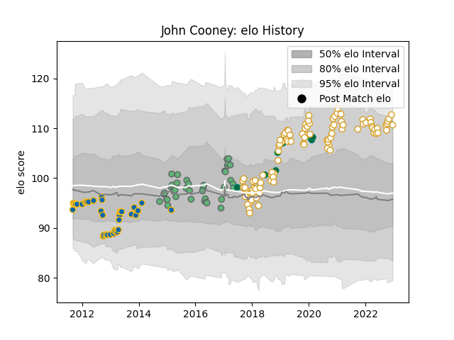

---  
layout: page  
title: John Cooney  
date: 2022-12-18 16:28:21.197378  
categories: player  
---
# John Cooney

## Positions: SH

## Country: Ireland

## Current elo: 111.0

## Current Percentile: 90.0

# Elo History

# Match History

| Team      |   Appearances |   Win Rate |
|:----------|--------------:|-----------:|
| Ulster    |            95 |   0.668421 |
| Leinster  |            44 |   0.738636 |
| Connacht  |            39 |   0.538462 |
| Ireland   |            11 |   0.818182 |
| Edinburgh |             1 |   0        |

| Opponent                 |   Matches |   Win Rate |
|:-------------------------|----------:|-----------:|
| Munster                  |        17 |   0.588235 |
| Glasgow Warriors         |        17 |   0.558824 |
| Ospreys                  |        14 |   0.5      |
| Scarlets                 |        12 |   0.75     |
| Zebre                    |        11 |   0.818182 |
| Benetton Treviso         |        11 |   0.909091 |
| Cardiff Blues            |        11 |   0.818182 |
| Connacht                 |        11 |   0.545455 |
| Dragons                  |        11 |   0.863636 |
| Edinburgh                |        11 |   0.727273 |
| Leinster                 |        11 |   0.272727 |
| Ulster                   |         6 |   0.333333 |
| Southern Kings           |         5 |   1        |
| Harlequins               |         4 |   1        |
| Wasps                    |         3 |   0.666667 |
| La Rochelle              |         3 |   0.333333 |
| Scotland                 |         2 |   1        |
| Northampton Saints       |         2 |   0.5      |
| Bath Rugby               |         2 |   1        |
| Stormers                 |         2 |   0        |
| Stade Toulousain         |         2 |   0        |
| Italy                    |         2 |   1        |
| Clermont Auvergne        |         2 |   0.5      |
| Aironi                   |         2 |   1        |
| England                  |         2 |   0        |
| Leicester Tigers         |         2 |   1        |
| Lions                    |         1 |   1        |
| Cheetahs                 |         1 |   1        |
| France                   |         1 |   1        |
| Sharks                   |         1 |   1        |
| Bulls                    |         1 |   0        |
| Stade Francais Paris     |         1 |   1        |
| Australia                |         1 |   1        |
| Biarritz Olympique       |         1 |   1        |
| United States of America |         1 |   1        |
| Wales                    |         1 |   1        |
| Japan                    |         1 |   1        |
| Grenoble                 |         1 |   0        |