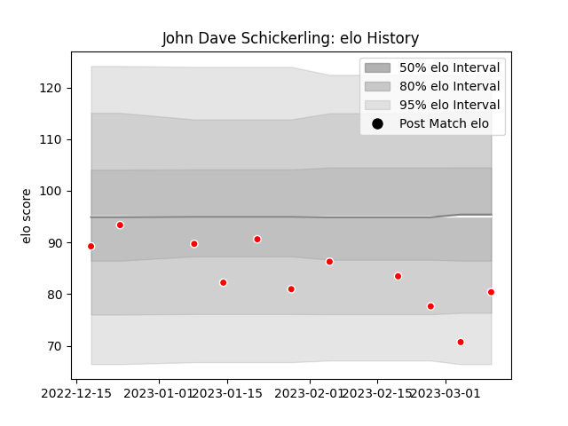

---  
layout: page  
title: John Dave Schickerling  
date: 2023-02-24 02:27:16.875647  
categories: player  
---
# John Dave Schickerling

## Positions: L

## Current elo: 83.0

## Current Percentile: 23.0

# Elo History

# Match History

| Team                  |   Appearances |   Win Rate |
|:----------------------|--------------:|-----------:|
| Kobelco Kobe Steelers |             8 |        0.5 |

| Opponent                          |   Matches |   Win Rate |
|:----------------------------------|----------:|-----------:|
| Green Rockets Tokatsu             |         1 |          1 |
| Hanazono Kintetsu Liners          |         1 |          1 |
| Kubota Spears Funabashi Tokyo-Bay |         1 |          0 |
| Mitsubishi Dynaboars              |         1 |          1 |
| Shizuoka Blue Revs                |         1 |          1 |
| Tokyo Sungoliath                  |         1 |          0 |
| Toyota Verblitz                   |         1 |          0 |
| Yokohama Canon Eagles             |         1 |          0 |