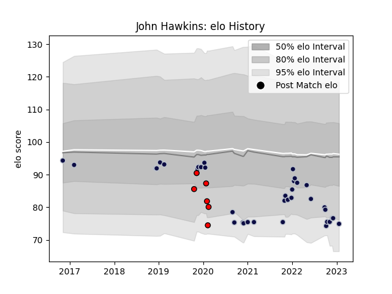

---  
layout: page  
title: John Hawkins  
date: 2022-12-09 13:08:08.670321  
categories: player  
---
# John Hawkins

## Positions: L

## Current elo: 83.0

## Current Percentile: 10.0

# Elo History

# Match History

| Team             |   Appearances |   Win Rate |
|:-----------------|--------------:|-----------:|
| Bristol Rugby    |            35 |   0.414286 |
| Hartpury College |             6 |   0.333333 |

| Opponent             |   Matches |   Win Rate |
|:---------------------|----------:|-----------:|
| Newcastle Falcons    |         5 |   0.2      |
| Sale Sharks          |         4 |   0.25     |
| London Irish         |         4 |   0.625    |
| Worcester Warriors   |         3 |   0.666667 |
| Exeter Chiefs        |         3 |   0        |
| Wasps                |         3 |   0        |
| Leicester Tigers     |         3 |   0.166667 |
| Stade Francais Paris |         2 |   1        |
| Brive                |         2 |   1        |
| La Rochelle          |         2 |   0.5      |
| Zebre                |         2 |   0.75     |
| Coventry             |         1 |   1        |
| Northampton Saints   |         1 |   0        |
| Nottingham           |         1 |   0        |
| RC Enisei            |         1 |   1        |
| London Scottish      |         1 |   1        |
| Saracens             |         1 |   0        |
| Gloucester Rugby     |         1 |   0        |
| Ealing Trailfinders  |         1 |   0        |