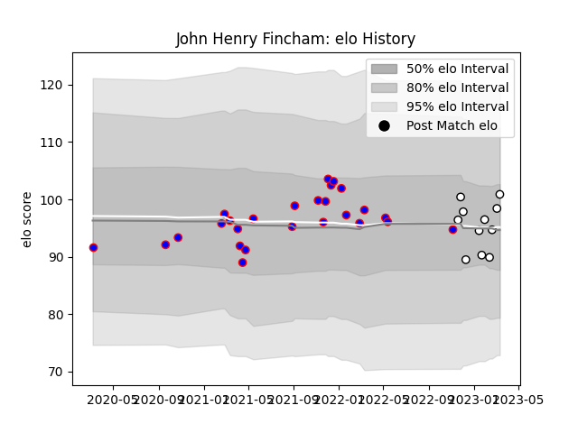

---  
layout: page  
title: John Henry Fincham  
date: 2023-01-17 11:29:07.967046  
categories: player  
---
# John Henry Fincham

## Positions: P

## Current elo: 97.0

## Current Percentile: 47.0

# Elo History

# Match History

| Team                       |   Appearances |   Win Rate |
|:---------------------------|--------------:|-----------:|
| Beziers                    |            26 |   0.326923 |
| Valence Romans Drome Rugby |             5 |   0.2      |

| Opponent                   |   Matches |   Win Rate |
|:---------------------------|----------:|-----------:|
| Carcassonne                |         3 |   0        |
| Rouen                      |         3 |   0.333333 |
| Provence Rugby             |         3 |   0.333333 |
| Vannes                     |         2 |   0.5      |
| US Bressane                |         2 |   0        |
| Aurillac                   |         2 |   0.5      |
| Oyonnax                    |         1 |   0        |
| Valence Romans Drome Rugby |         1 |   0.5      |
| Tarbes                     |         1 |   1        |
| Soyaux-Angouleme           |         1 |   0        |
| Roval Drome XV             |         1 |   1        |
| Perpignan                  |         1 |   0        |
| Agen                       |         1 |   1        |
| Narbonne                   |         1 |   1        |
| Mont-de-Marsan             |         1 |   0        |
| Grenoble                   |         1 |   1        |
| Dax                        |         1 |   0        |
| Colomiers                  |         1 |   0        |
| Chambery                   |         1 |   0        |
| Blagnac                    |         1 |   0        |
| Biarritz Olympique         |         1 |   0        |
| Nevers                     |         1 |   0        |