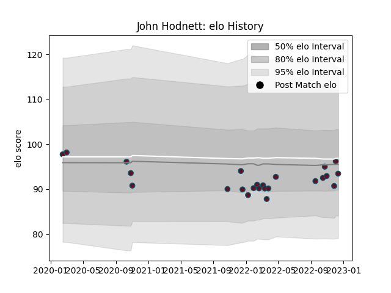

---  
layout: page  
title: John Hodnett  
date: 2022-12-18 16:29:07.645597  
categories: player  
---
# John Hodnett

## Positions: FL

## Current elo: 94.0

## Current Percentile: 52.0

# Elo History

# Match History

| Team    |   Appearances |   Win Rate |
|:--------|--------------:|-----------:|
| Munster |            24 |   0.666667 |

| Opponent          |   Matches |   Win Rate |
|:------------------|----------:|-----------:|
| Ulster            |         3 |   0.666667 |
| Edinburgh         |         3 |   1        |
| Cardiff Blues     |         2 |   0.5      |
| Dragons           |         2 |   1        |
| Bulls             |         2 |   0.5      |
| Benetton Treviso  |         1 |   1        |
| Scarlets          |         1 |   1        |
| Wasps             |         1 |   1        |
| Stade Toulousain  |         1 |   0        |
| Southern Kings    |         1 |   1        |
| Leinster          |         1 |   0        |
| Ospreys           |         1 |   0        |
| Lions             |         1 |   0        |
| Glasgow Warriors  |         1 |   0        |
| Connacht          |         1 |   1        |
| Castres Olympique |         1 |   1        |
| Zebre             |         1 |   1        |