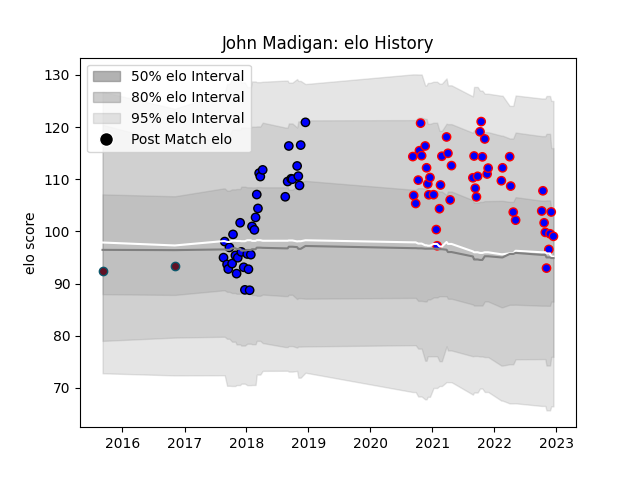

---  
layout: page  
title: John Madigan  
date: 2022-12-12 15:30:53.863276  
categories: player  
---
# John Madigan

## Positions: L

## Current elo: 99.0

## Current Percentile: 53.0

# Elo History

# Match History

| Team    |   Appearances |   Win Rate |
|:--------|--------------:|-----------:|
| Beziers |            38 |   0.368421 |
| Massy   |            29 |   0.448276 |
| Munster |             2 |   1        |

| Opponent                   |   Matches |   Win Rate |
|:---------------------------|----------:|-----------:|
| Vannes                     |         6 |   0.166667 |
| Colomiers                  |         6 |   0.666667 |
| Nevers                     |         6 |   0.333333 |
| Mont-de-Marsan             |         5 |   0.2      |
| Bayonne                    |         4 |   0.25     |
| Provence Rugby             |         4 |   0.5      |
| Aurillac                   |         4 |   0.5      |
| Oyonnax                    |         4 |   0.125    |
| Carcassonne                |         3 |   0.666667 |
| Grenoble                   |         3 |   0.333333 |
| Soyaux-Angouleme           |         3 |   0.333333 |
| Narbonne                   |         3 |   0.666667 |
| Biarritz Olympique         |         3 |   0.666667 |
| Rouen                      |         3 |   0.333333 |
| Valence Romans Drome Rugby |         2 |   0.75     |
| US Bressane                |         2 |   0        |
| Perpignan                  |         2 |   0.5      |
| Beziers                    |         1 |   0        |
| Ospreys                    |         1 |   1        |
| Massy                      |         1 |   1        |
| Dax                        |         1 |   0        |
| Benetton Treviso           |         1 |   1        |
| Agen                       |         1 |   1        |